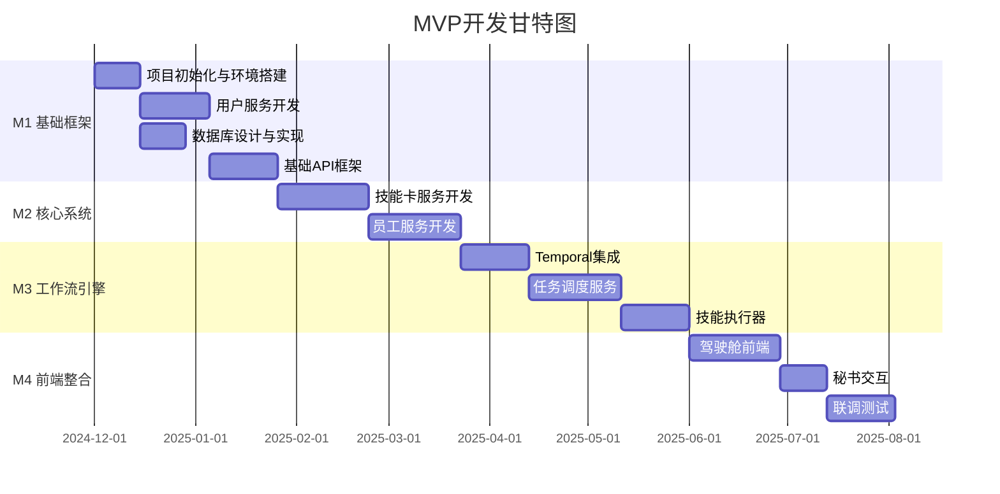

# 《无限公司 Unlimited Corp.》MVP开发总体规划

## 文档信息
| 项目 | 内容 |
|------|------|
| 创建日期 | 2024年12月 |
| 预计周期 | 6-8个月 |
| 版本目标 | 1.0 MVP |

---

## 1. 项目概述

### 1.1 产品定位
《无限公司》是面向内容创作者与中小企业的AI智能体管理与协作平台，让用户以"CEO"身份管理由AI员工组成的虚拟公司。

### 1.2 MVP核心目标
- 验证"虚拟AI团队"核心概念
- 跑通从任务发布到交付的最小可行闭环
- 达成：任务完成成功率 > 90%，平均任务时长较人工操作缩短70%

---

## 2. MVP功能范围

### 2.1 功能清单（Must Have）

```
┌─────────────────────────────────────────────────────────────────────────────┐
│                          MVP 1.0 功能范围                                    │
├─────────────────────────────────────────────────────────────────────────────┤
│                                                                             │
│  ✅ 用户系统                                                                │
│     ├── 用户注册/登录                                                       │
│     ├── 公司自动创建                                                        │
│     └── 免费版功能限制                                                      │
│                                                                             │
│  ✅ 技能卡系统                                                              │
│     ├── 3个预置技能卡（热点分析、文案生成、配图生成）                         │
│     ├── 技能卡浏览与详情查看                                                │
│     └── 技能卡测试功能                                                      │
│                                                                             │
│  ✅ 员工系统                                                                │
│     ├── 5个预置员工模板                                                     │
│     ├── 员工招募（上限5名）                                                 │
│     ├── 技能卡装备/卸载                                                     │
│     └── 员工状态显示（空闲/工作中）                                         │
│                                                                             │
│  ✅ 工作流引擎                                                              │
│     ├── 3个预置工作流模板                                                   │
│     ├── 选择模板创建任务                                                    │
│     ├── 任务监控（进度、状态）                                              │
│     └── 任务干预（暂停、取消、重试）                                        │
│                                                                             │
│  ✅ 驾驶舱首页                                                              │
│     ├── 简化版KPI面板（任务数、成功率）                                     │
│     ├── 任务列表                                                            │
│     └── 基础活动流                                                          │
│                                                                             │
│  ✅ 秘书系统                                                                │
│     └── 私人秘书基础交互（任务创建、状态查询）                               │
│                                                                             │
│  ✅ 平台                                                                    │
│     └── Web端（React SPA）                                                  │
│                                                                             │
└─────────────────────────────────────────────────────────────────────────────┘
```

### 2.2 延后功能（Not In MVP）

| 功能 | 延后版本 | 原因 |
|------|----------|------|
| 自定义技能卡创建 | 2.0 | 非核心闭环必需 |
| 可视化工作流设计器 | 2.0 | 复杂度高 |
| 技能卡市场交易 | 3.0 | 需完整支付体系 |
| 移动端App | 2.0 | 先验证Web端 |
| 桌面端EXE | 2.0 | 先验证Web端 |
| 业务秘书日报 | 2.0 | 非核心功能 |
| 生活秘书状态感知 | 2.0 | 非核心功能 |
| 付费订阅 | 2.0 | MVP先免费验证 |
| 团队协作 | 3.0 | 复杂度高 |
| 外包系统 | 3.0 | 需完整生态 |

---

## 3. 技术架构选型

### 3.1 技术栈总览

| 层级 | 技术选型 | 说明 |
|------|----------|------|
| 前端 | React 18 + TypeScript + Vite | 现代化SPA |
| UI组件 | Ant Design / Tailwind CSS | 快速开发 |
| 状态管理 | Zustand | 轻量级状态管理 |
| 后端框架 | Go + Gin | 高性能HTTP服务 |
| 工作流引擎 | Temporal | 分布式工作流编排 |
| 消息队列 | Apache Kafka | 事件驱动核心 |
| 数据库 | PostgreSQL 15+ | 主数据存储 |
| 缓存 | Redis 7+ | 状态缓存 |
| 对象存储 | MinIO | 文件存储 |
| 搜索 | Elasticsearch | 技能卡搜索 |
| 容器 | Docker + Docker Compose | 本地开发 |
| AI接入 | OpenAI API / Claude API | LLM调用 |

### 3.2 服务架构

```
┌─────────────────────────────────────────────────────────────────────────────┐
│                          MVP 服务架构                                        │
├─────────────────────────────────────────────────────────────────────────────┤
│                                                                             │
│  前端层                                                                      │
│  └── Web SPA (React + TypeScript)                                           │
│                                                                             │
│  API网关层                                                                   │
│  └── Nginx (反向代理 + 静态资源)                                             │
│                                                                             │
│  业务服务层 (Go + Gin)                                                       │
│  ├── user-service      用户认证、公司管理                                    │
│  ├── skillcard-service 技能卡CRUD                                           │
│  ├── employee-service  员工管理、状态维护                                    │
│  ├── workflow-service  工作流编排与执行                                      │
│  ├── task-service      任务生命周期管理                                      │
│  ├── scheduler-service 任务调度与员工匹配                                    │
│  ├── skill-executor    技能卡执行引擎                                        │
│  ├── secretary-service 秘书交互逻辑                                          │
│  └── gateway-service   API网关（统一入口）                                   │
│                                                                             │
│  核心引擎层                                                                  │
│  ├── Temporal          工作流引擎                                            │
│  └── AI Gateway        LLM调用适配                                          │
│                                                                             │
│  数据层                                                                      │
│  ├── PostgreSQL        主数据库                                              │
│  ├── Redis             缓存/会话                                             │
│  ├── Kafka             事件队列                                              │
│  └── MinIO             文件存储                                              │
│                                                                             │
└─────────────────────────────────────────────────────────────────────────────┘
```

---

## 4. 开发里程碑

### 4.1 里程碑总览



### 4.2 M1: 基础框架（第1-2月）

**目标**: 搭建项目骨架，完成用户系统

| 周次 | 任务 | 交付物 | 验收标准 |
|------|------|--------|----------|
| W1 | 项目初始化 | 代码仓库、目录结构、CI/CD配置 | 可构建运行 |
| W2 | 开发环境搭建 | Docker Compose编排 | 本地一键启动 |
| W3-4 | 用户服务 | 注册/登录/JWT认证API | 通过单元测试 |
| W5-6 | 数据库实现 | 核心表结构、Migration | 可执行CRUD |
| W7-8 | API网关 | 统一路由、认证中间件 | 接口可访问 |

**M1交付清单**:
- [x] 项目代码仓库与分支策略
- [x] Docker开发环境
- [x] 用户注册/登录API
- [x] JWT认证机制
- [x] 核心数据库表结构
- [x] API网关统一入口

### 4.3 M2: 核心系统（第3-4月）

**目标**: 完成技能卡系统和员工系统

| 周次 | 任务 | 交付物 | 验收标准 |
|------|------|--------|----------|
| W9-10 | 技能卡服务 | 技能卡CRUD API | CRUD测试通过 |
| W11-12 | 技能卡数据 | 预置技能卡数据 | 3个技能卡可用 |
| W13-14 | 员工服务 | 员工管理API | 招募/装备测试通过 |
| W15-16 | 员工模板 | 预置员工模板 | 5个模板可用 |

**M2交付清单**:
- [x] 技能卡CRUD完整API
- [x] 3个预置技能卡（热点分析、文案生成、配图生成）
- [x] 员工招募/解雇API
- [x] 技能卡装备/卸载API
- [x] 5个预置员工模板
- [x] 员工状态管理

### 4.4 M3: 工作流引擎（第5-6月）

**目标**: 实现工作流编排与任务执行

| 周次 | 任务 | 交付物 | 验收标准 |
|------|------|--------|----------|
| W17-19 | Temporal集成 | 工作流引擎接入 | 基础流程可执行 |
| W20-23 | 任务调度 | 调度算法、队列管理 | 任务分配正确 |
| W24-26 | 技能执行器 | AI调用、结果处理 | 技能执行成功 |

**M3交付清单**:
- [x] Temporal工作流引擎集成
- [x] 3个预置工作流模板
- [x] 任务创建/监控/干预API
- [x] 员工调度算法
- [x] 技能卡执行器（AI调用）
- [x] 任务状态事件通知

### 4.5 M4: 前端整合（第7-8月）

**目标**: 完成前端界面与系统联调

| 周次 | 任务 | 交付物 | 验收标准 |
|------|------|--------|----------|
| W27-30 | 驾驶舱前端 | CEO首页、任务中心 | 界面可交互 |
| W31-32 | 秘书交互 | 私人秘书对话 | 指令可执行 |
| W33-35 | 联调测试 | 端到端测试 | 全流程通过 |

**M4交付清单**:
- [x] CEO驾驶舱首页
- [x] 任务控制中心
- [x] 员工管理界面
- [x] 技能卡管理界面
- [x] 私人秘书对话交互
- [x] 端到端测试通过

---

## 5. 验收标准

### 5.1 功能验收

| 验收项 | 验收标准 |
|--------|----------|
| 用户注册登录 | 可完成注册、登录、Token刷新 |
| 公司创建 | 注册后自动创建虚拟公司 |
| 员工招募 | 可招募至少3名员工 |
| 技能装备 | 可为员工装备技能卡 |
| 任务创建 | 可使用预置工作流创建任务 |
| 任务执行 | 任务可成功执行并获得产出物 |
| 任务监控 | 可查看任务进度和状态 |
| 秘书交互 | 可通过自然语言创建任务 |

### 5.2 性能验收

| 指标 | 目标值 |
|------|--------|
| 任务成功率 | ≥ 90% |
| 平均任务执行时间 | ≤ 5分钟 |
| API响应时间P95 | ≤ 500ms |
| 页面加载时间 | ≤ 2秒 |
| 系统可用性 | ≥ 99% |

---

## 6. 风险与应对

| 风险 | 影响 | 应对策略 |
|------|------|----------|
| Temporal学习成本高 | 延期 | 提前学习、准备备选方案(自研简化版) |
| AI API不稳定 | 任务失败 | 多模型备份、熔断降级 |
| 工作流复杂度 | 延期 | MVP简化节点类型，仅支持顺序执行 |
| 前端工作量大 | 延期 | 使用组件库、简化交互 |

---

## 7. 团队分工建议

| 角色 | 职责 | 建议人数 |
|------|------|----------|
| 后端工程师 | Go服务开发、数据库设计 | 2-3人 |
| 前端工程师 | React界面开发 | 1-2人 |
| 全栈工程师 | Temporal集成、AI对接 | 1人 |
| 测试工程师 | 单元测试、集成测试 | 1人 |

---

## 8. 下一步行动

1. **立即启动**: 阅读技术栈配置文档，准备开发环境
2. **第一周**: 完成项目初始化、代码仓库搭建
3. **持续**: 按里程碑推进，每周更新进度

---

*文档结束*
