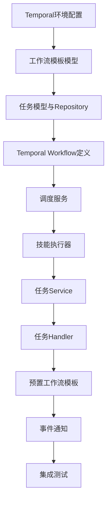

# M3阶段：工作流引擎开发任务

## 阶段信息
| 项目 | 内容 |
|------|------|
| 阶段代号 | M3 |
| 阶段名称 | 工作流引擎 |
| 预计周期 | 第17-26周（约2.5个月） |
| 核心目标 | 实现工作流编排与任务执行 |

---

## 1. 阶段目标

### 1.1 交付物清单

- [ ] Temporal工作流引擎集成
- [ ] 3个预置工作流模板
- [ ] 任务创建/监控/干预API
- [ ] 员工调度算法
- [ ] 技能卡执行器（AI调用）
- [ ] 任务状态事件通知

### 1.2 验收标准

| 验收项 | 标准 |
|--------|------|
| 工作流模板 | 可获取预置模板列表 |
| 任务创建 | 可基于模板创建任务 |
| 任务执行 | 任务可自动调度并执行 |
| 任务监控 | 可查看任务进度和步骤状态 |
| 任务干预 | 支持暂停/恢复/取消/重试 |
| 员工调度 | 正确匹配技能并分配员工 |

---

## 2. 任务拆解

### 2.1 任务依赖图



### 2.2 详细任务列表

---

#### T1: Temporal环境配置
**预计时间**: 2天

**目标**: 完成Temporal SDK集成和基础配置

```go
// backend/pkg/temporal/client.go
package temporal

import (
    "go.temporal.io/sdk/client"
    "go.temporal.io/sdk/worker"
)

type TemporalClient struct {
    client client.Client
    worker worker.Worker
}

func NewClient(hostPort, namespace string) (*TemporalClient, error) {
    c, err := client.Dial(client.Options{
        HostPort:  hostPort,
        Namespace: namespace,
    })
    if err != nil {
        return nil, err
    }
    return &TemporalClient{client: c}, nil
}

func (tc *TemporalClient) StartWorker(taskQueue string, workflows []interface{}, activities []interface{}) error {
    tc.worker = worker.New(tc.client, taskQueue, worker.Options{})
    
    for _, wf := range workflows {
        tc.worker.RegisterWorkflow(wf)
    }
    for _, act := range activities {
        tc.worker.RegisterActivity(act)
    }
    
    return tc.worker.Start()
}
```

---

#### T2: 工作流模板模型
**预计时间**: 1天

```go
// backend/internal/domain/workflow.go
package domain

type WorkflowTemplate struct {
    ID            string                 `json:"id"`
    Name          string                 `json:"name"`
    Description   string                 `json:"description"`
    Category      string                 `json:"category"`
    Nodes         []WorkflowNode         `json:"nodes"`
    Edges         []WorkflowEdge         `json:"edges"`
    InputSchema   map[string]interface{} `json:"inputSchema"`
    EstimatedTime int                    `json:"estimatedTime"`
    CreatorID     string                 `json:"creatorId"`
    IsPublic      bool                   `json:"isPublic"`
    IsSystem      bool                   `json:"isSystem"`
    UsageCount    int                    `json:"usageCount"`
    SuccessRate   float64                `json:"successRate"`
    Version       int                    `json:"version"`
    Thumbnail     string                 `json:"thumbnail"`
    CreatedAt     time.Time              `json:"createdAt"`
    UpdatedAt     time.Time              `json:"updatedAt"`
}

type WorkflowNode struct {
    ID       string                 `json:"id"`
    Type     NodeType               `json:"type"`
    Name     string                 `json:"name"`
    Position NodePosition           `json:"position"`
    Config   map[string]interface{} `json:"config"`
}

type NodeType string

const (
    NodeTypeStart NodeType = "start"
    NodeTypeEnd   NodeType = "end"
    NodeTypeSkill NodeType = "skill"
)

type NodePosition struct {
    X int `json:"x"`
    Y int `json:"y"`
}

type WorkflowEdge struct {
    Source string `json:"source"`
    Target string `json:"target"`
}

type SkillNodeConfig struct {
    SkillCardID  string        `json:"skillCardId"`
    InputMapping []DataMapping `json:"inputMapping"`
    Timeout      int           `json:"timeout"`
    RetryPolicy  RetryPolicy   `json:"retryPolicy"`
}

type DataMapping struct {
    Source string `json:"source"`
    Target string `json:"target"`
}

type RetryPolicy struct {
    MaxRetries int `json:"maxRetries"`
    RetryDelay int `json:"retryDelay"`
}
```

---

#### T3: 任务模型与Repository
**预计时间**: 2天

```go
// backend/internal/domain/task.go
package domain

type Task struct {
    ID              string                 `json:"id"`
    CompanyID       string                 `json:"companyId"`
    WorkflowID      string                 `json:"workflowId"`
    WorkflowVersion int                    `json:"workflowVersion"`
    Name            string                 `json:"name"`
    Status          TaskStatus             `json:"status"`
    Priority        int                    `json:"priority"`
    InputParams     map[string]interface{} `json:"inputParams"`
    OutputResult    map[string]interface{} `json:"outputResult"`
    Progress        int                    `json:"progress"`
    ErrorMessage    string                 `json:"errorMessage"`
    TemporalRunID   string                 `json:"temporalRunId"`
    StartedAt       *time.Time             `json:"startedAt"`
    CompletedAt     *time.Time             `json:"completedAt"`
    ScheduledAt     *time.Time             `json:"scheduledAt"`
    CreatedAt       time.Time              `json:"createdAt"`
    UpdatedAt       time.Time              `json:"updatedAt"`
}

type TaskStatus string

const (
    TaskStatusPending   TaskStatus = "pending"
    TaskStatusRunning   TaskStatus = "running"
    TaskStatusPaused    TaskStatus = "paused"
    TaskStatusCompleted TaskStatus = "completed"
    TaskStatusFailed    TaskStatus = "failed"
    TaskStatusCancelled TaskStatus = "cancelled"
)

type TaskStep struct {
    ID           string                 `json:"id"`
    TaskID       string                 `json:"taskId"`
    NodeID       string                 `json:"nodeId"`
    SkillCardID  string                 `json:"skillCardId"`
    Sequence     int                    `json:"sequence"`
    Status       StepStatus             `json:"status"`
    InputData    map[string]interface{} `json:"inputData"`
    OutputData   map[string]interface{} `json:"outputData"`
    RetryCount   int                    `json:"retryCount"`
    ErrorMessage string                 `json:"errorMessage"`
    StartedAt    *time.Time             `json:"startedAt"`
    CompletedAt  *time.Time             `json:"completedAt"`
    CreatedAt    time.Time              `json:"createdAt"`
}

type StepStatus string

const (
    StepStatusPending   StepStatus = "pending"
    StepStatusAssigned  StepStatus = "assigned"
    StepStatusRunning   StepStatus = "running"
    StepStatusCompleted StepStatus = "completed"
    StepStatusFailed    StepStatus = "failed"
)

type TaskAssignment struct {
    ID           string                 `json:"id"`
    TaskStepID   string                 `json:"taskStepId"`
    EmployeeID   string                 `json:"employeeId"`
    Status       string                 `json:"status"`
    AssignedAt   time.Time              `json:"assignedAt"`
    StartedAt    *time.Time             `json:"startedAt"`
    CompletedAt  *time.Time             `json:"completedAt"`
    ExecutionLog map[string]interface{} `json:"executionLog"`
}
```

---

#### T4: Temporal Workflow定义
**预计时间**: 3天

```go
// backend/internal/workflow/task_workflow.go
package workflow

import (
    "go.temporal.io/sdk/workflow"
    "time"
)

type TaskWorkflowInput struct {
    TaskID       string
    CompanyID    string
    WorkflowDef  *domain.WorkflowTemplate
    InputParams  map[string]interface{}
}

type TaskWorkflowOutput struct {
    TaskID   string
    Status   string
    Output   map[string]interface{}
    Error    string
}

// TaskWorkflow 主工作流
func TaskWorkflow(ctx workflow.Context, input TaskWorkflowInput) (*TaskWorkflowOutput, error) {
    logger := workflow.GetLogger(ctx)
    logger.Info("Starting task workflow", "taskId", input.TaskID)
    
    // 按顺序执行每个节点
    nodeOutputs := make(map[string]interface{})
    nodes := sortNodesBySequence(input.WorkflowDef.Nodes, input.WorkflowDef.Edges)
    
    for _, node := range nodes {
        if node.Type == domain.NodeTypeStart || node.Type == domain.NodeTypeEnd {
            continue
        }
        
        if node.Type == domain.NodeTypeSkill {
            // 执行技能节点
            stepInput := prepareStepInput(node, nodeOutputs, input.InputParams)
            
            var stepOutput StepActivityOutput
            err := workflow.ExecuteActivity(
                workflow.WithActivityOptions(ctx, workflow.ActivityOptions{
                    StartToCloseTimeout: time.Duration(node.Config.Timeout) * time.Second,
                    RetryPolicy: &temporal.RetryPolicy{
                        MaximumAttempts: int32(node.Config.RetryPolicy.MaxRetries),
                    },
                }),
                ExecuteStepActivity,
                StepActivityInput{
                    TaskID:      input.TaskID,
                    NodeID:      node.ID,
                    CompanyID:   input.CompanyID,
                    SkillCardID: node.Config.SkillCardID,
                    Input:       stepInput,
                },
            ).Get(ctx, &stepOutput)
            
            if err != nil {
                return &TaskWorkflowOutput{
                    TaskID: input.TaskID,
                    Status: "failed",
                    Error:  err.Error(),
                }, nil
            }
            
            nodeOutputs[node.ID] = stepOutput.Output
        }
    }
    
    return &TaskWorkflowOutput{
        TaskID: input.TaskID,
        Status: "completed",
        Output: nodeOutputs,
    }, nil
}

// ExecuteStepActivity 步骤执行Activity
func ExecuteStepActivity(ctx context.Context, input StepActivityInput) (*StepActivityOutput, error) {
    // 1. 查找合适的员工
    employee, err := scheduler.FindEmployee(ctx, input.CompanyID, input.SkillCardID)
    if err != nil {
        return nil, err
    }
    
    // 2. 更新员工状态为工作中
    err = employeeRepo.UpdateStatus(ctx, employee.ID, domain.StatusWorking)
    if err != nil {
        return nil, err
    }
    defer employeeRepo.UpdateStatus(ctx, employee.ID, domain.StatusIdle)
    
    // 3. 执行技能卡
    skillCard, err := skillCardRepo.GetByID(ctx, input.SkillCardID)
    if err != nil {
        return nil, err
    }
    
    result, err := skillExecutor.Execute(ctx, skillCard, input.Input)
    if err != nil {
        return nil, err
    }
    
    return &StepActivityOutput{
        Output:     result.Output,
        EmployeeID: employee.ID,
        Duration:   result.ExecutionTime,
    }, nil
}
```

---

#### T5: 调度服务
**预计时间**: 3天

```go
// backend/internal/service/scheduler.go
package service

type Scheduler interface {
    FindEmployee(ctx context.Context, companyID, skillCardID string) (*domain.Employee, error)
}

type SchedulerImpl struct {
    employeeRepo      repository.EmployeeRepository
    skillEquipRepo    repository.SkillEquipRepository
    taskAssignmentRepo repository.TaskAssignmentRepository
    logger            *zap.Logger
}

func (s *SchedulerImpl) FindEmployee(ctx context.Context, companyID, skillCardID string) (*domain.Employee, error) {
    // 1. 查找装备了指定技能卡的员工
    employees, err := s.employeeRepo.ListByCompany(ctx, companyID, &repository.EmployeeFilter{
        SkillCardID: skillCardID,
    })
    if err != nil {
        return nil, err
    }
    
    if len(employees) == 0 {
        return nil, ErrNoAvailableEmployee
    }
    
    // 2. 计算每个员工的得分
    type ScoredEmployee struct {
        Employee *domain.Employee
        Score    float64
    }
    
    scored := make([]ScoredEmployee, 0, len(employees))
    for _, emp := range employees {
        score := s.calculateScore(ctx, emp)
        scored = append(scored, ScoredEmployee{
            Employee: emp,
            Score:    score,
        })
    }
    
    // 3. 排序选择得分最高的
    sort.Slice(scored, func(i, j int) bool {
        return scored[i].Score > scored[j].Score
    })
    
    return scored[0].Employee, nil
}

func (s *SchedulerImpl) calculateScore(ctx context.Context, emp *domain.Employee) float64 {
    score := 0.0
    
    // 状态得分（40%）
    if emp.Status == domain.StatusIdle {
        score += 40
    } else {
        // 工作中根据当前队列长度扣分
        queueLen := s.getQueueLength(ctx, emp.ID)
        score += math.Max(0, 40-float64(queueLen)*5)
    }
    
    // 历史成功率（30%）
    score += emp.Performance.SuccessRate * 30
    
    // 负载均衡（30%）- 今日任务少的优先
    todayPenalty := math.Min(float64(emp.Performance.TodayTasks)*2, 30)
    score += (30 - todayPenalty)
    
    return score
}
```

---

#### T6: 技能执行器
**预计时间**: 3天

```go
// backend/internal/service/skill_executor.go
package service

type SkillExecutor interface {
    Execute(ctx context.Context, card *domain.SkillCard, input map[string]interface{}) (*ExecutionResult, error)
}

type ExecutionResult struct {
    Output        map[string]interface{}
    TokensUsed    int
    ExecutionTime int64
    Error         string
}

type SkillExecutorImpl struct {
    aiGateway AIGateway
    logger    *zap.Logger
}

func (e *SkillExecutorImpl) Execute(ctx context.Context, card *domain.SkillCard, input map[string]interface{}) (*ExecutionResult, error) {
    start := time.Now()
    
    switch card.KernelType {
    case "ai_model":
        return e.executeAIModel(ctx, card, input, start)
    case "code_logic":
        return e.executeCodeLogic(ctx, card, input, start)
    default:
        return nil, fmt.Errorf("unsupported kernel type: %s", card.KernelType)
    }
}

func (e *SkillExecutorImpl) executeAIModel(ctx context.Context, card *domain.SkillCard, input map[string]interface{}, start time.Time) (*ExecutionResult, error) {
    // 渲染提示词模板
    prompt, err := e.renderTemplate(card.KernelConfig.UserPromptTemplate, input)
    if err != nil {
        return nil, err
    }
    
    // 调用AI Gateway
    resp, err := e.aiGateway.ChatCompletion(ctx, &AIRequest{
        Model:       card.KernelConfig.ModelID,
        SystemPrompt: card.KernelConfig.SystemPrompt,
        UserPrompt:  prompt,
        Temperature: card.KernelConfig.Temperature,
        MaxTokens:   card.KernelConfig.MaxTokens,
    })
    if err != nil {
        return nil, err
    }
    
    // 解析输出
    output, err := e.parseOutput(resp.Content, card.OutputSchema)
    if err != nil {
        // 如果解析失败，尝试直接返回原始内容
        output = map[string]interface{}{
            "content": resp.Content,
        }
    }
    
    return &ExecutionResult{
        Output:        output,
        TokensUsed:    resp.TokensUsed,
        ExecutionTime: time.Since(start).Milliseconds(),
    }, nil
}
```

---

#### T7-T8: 任务Service和Handler
**预计时间**: 3天

```go
// Service
type TaskService interface {
    Create(ctx context.Context, companyID string, req *CreateTaskRequest) (*domain.Task, error)
    List(ctx context.Context, companyID string, filter *TaskFilter) (*TaskListResponse, error)
    GetByID(ctx context.Context, taskID, companyID string) (*TaskDetail, error)
    Pause(ctx context.Context, taskID, companyID string) error
    Resume(ctx context.Context, taskID, companyID string) error
    Cancel(ctx context.Context, taskID, companyID string, reason string) error
    Retry(ctx context.Context, taskID, companyID string, fromStep string) error
}

// Handler Routes
func (h *TaskHandler) RegisterRoutes(g *gin.RouterGroup) {
    tasks := g.Group("/tasks")
    {
        tasks.GET("", h.List)                   // GET /api/v1/tasks
        tasks.GET("/:id", h.GetByID)            // GET /api/v1/tasks/:id
        tasks.POST("", h.Create)                // POST /api/v1/tasks
        tasks.POST("/:id/pause", h.Pause)       // POST /api/v1/tasks/:id/pause
        tasks.POST("/:id/resume", h.Resume)     // POST /api/v1/tasks/:id/resume
        tasks.POST("/:id/cancel", h.Cancel)     // POST /api/v1/tasks/:id/cancel
        tasks.POST("/:id/retry", h.Retry)       // POST /api/v1/tasks/:id/retry
    }
    
    workflows := g.Group("/workflows")
    {
        workflows.GET("", h.ListWorkflows)      // GET /api/v1/workflows
        workflows.GET("/:id", h.GetWorkflow)    // GET /api/v1/workflows/:id
    }
}
```

---

#### T9: 预置工作流模板
**预计时间**: 1天

```sql
-- 3个预置工作流模板
INSERT INTO workflow_templates (id, name, description, category, nodes, edges, 
    input_schema, estimated_time, is_public, is_system, thumbnail) VALUES
(
    'wf_xiaohongshu_001',
    '小红书内容生产流水线',
    '从热点分析到内容生成的完整流程',
    'content',
    '[
        {"id": "start", "type": "start", "name": "开始", "position": {"x": 100, "y": 200}},
        {"id": "hotspot", "type": "skill", "name": "热点分析", "position": {"x": 250, "y": 200}, "config": {"skillCardId": "skc_hotspot_001", "timeout": 60}},
        {"id": "content", "type": "skill", "name": "文案生成", "position": {"x": 400, "y": 200}, "config": {"skillCardId": "skc_xiaohongshu_001", "timeout": 120, "inputMapping": [{"source": "nodes.hotspot.output.topic", "target": "input.topic"}, {"source": "nodes.hotspot.output.keywords", "target": "input.keywords"}]}},
        {"id": "end", "type": "end", "name": "结束", "position": {"x": 550, "y": 200}}
    ]',
    '[
        {"source": "start", "target": "hotspot"},
        {"source": "hotspot", "target": "content"},
        {"source": "content", "target": "end"}
    ]',
    '{"type": "object", "required": ["platform"], "properties": {"platform": {"type": "string", "enum": ["xiaohongshu", "douyin", "weibo"]}}}',
    180,
    true, true,
    '/thumbnails/xiaohongshu-pipeline.png'
),
(
    'wf_visual_content_001',
    '图文内容生产线',
    '生成文案并自动配图',
    'visual',
    '[
        {"id": "start", "type": "start", "name": "开始", "position": {"x": 100, "y": 200}},
        {"id": "content", "type": "skill", "name": "文案生成", "position": {"x": 250, "y": 200}, "config": {"skillCardId": "skc_xiaohongshu_001", "timeout": 120}},
        {"id": "image", "type": "skill", "name": "配图生成", "position": {"x": 400, "y": 200}, "config": {"skillCardId": "skc_image_001", "timeout": 180, "inputMapping": [{"source": "nodes.content.output.content", "target": "input.description"}]}},
        {"id": "end", "type": "end", "name": "结束", "position": {"x": 550, "y": 200}}
    ]',
    '[
        {"source": "start", "target": "content"},
        {"source": "content", "target": "image"},
        {"source": "image", "target": "end"}
    ]',
    '{"type": "object", "required": ["topic"], "properties": {"topic": {"type": "string"}, "style": {"type": "string", "default": "种草"}}}',
    300,
    true, true,
    '/thumbnails/visual-content.png'
),
(
    'wf_hotspot_analysis_001',
    '热点快速分析',
    '快速获取平台热点趋势',
    'creative',
    '[
        {"id": "start", "type": "start", "name": "开始", "position": {"x": 100, "y": 200}},
        {"id": "hotspot", "type": "skill", "name": "热点分析", "position": {"x": 250, "y": 200}, "config": {"skillCardId": "skc_hotspot_001", "timeout": 60}},
        {"id": "end", "type": "end", "name": "结束", "position": {"x": 400, "y": 200}}
    ]',
    '[
        {"source": "start", "target": "hotspot"},
        {"source": "hotspot", "target": "end"}
    ]',
    '{"type": "object", "required": ["platform"], "properties": {"platform": {"type": "string", "enum": ["xiaohongshu", "douyin", "weibo"]}, "category": {"type": "string"}}}',
    60,
    true, true,
    '/thumbnails/hotspot-analysis.png'
);
```

---

#### T10-T11: 事件通知与集成测试
**预计时间**: 3天

事件通知通过Kafka发布：
```go
type TaskEvent struct {
    EventType string      `json:"eventType"`
    TaskID    string      `json:"taskId"`
    CompanyID string      `json:"companyId"`
    Data      interface{} `json:"data"`
    Timestamp time.Time   `json:"timestamp"`
}

// 事件类型
const (
    EventTaskCreated    = "task.created"
    EventTaskStarted    = "task.started"
    EventTaskCompleted  = "task.completed"
    EventTaskFailed     = "task.failed"
    EventStepStarted    = "step.started"
    EventStepCompleted  = "step.completed"
    EventProgressUpdate = "task.progress"
)
```

---

## 3. 进度跟踪

| 任务 | 状态 | 开始时间 | 完成时间 | 备注 |
|------|------|----------|----------|------|
| T1: Temporal环境配置 | PENDING | - | - | - |
| T2: 工作流模板模型 | PENDING | - | - | - |
| T3: 任务模型与Repository | PENDING | - | - | - |
| T4: Temporal Workflow定义 | PENDING | - | - | - |
| T5: 调度服务 | PENDING | - | - | - |
| T6: 技能执行器 | PENDING | - | - | - |
| T7: 任务Service | PENDING | - | - | - |
| T8: 任务Handler | PENDING | - | - | - |
| T9: 预置工作流模板 | PENDING | - | - | - |
| T10: 事件通知 | PENDING | - | - | - |
| T11: 集成测试 | PENDING | - | - | - |

---

*文档结束*
