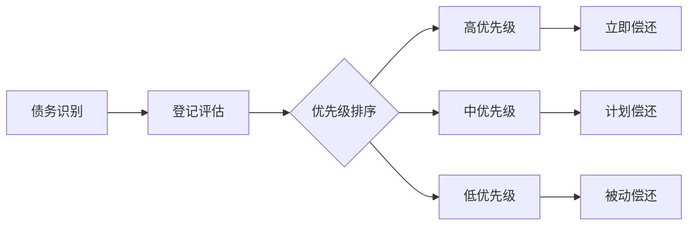

# 📊 技术债务管理规则

## 1. 文档目的
建立技术债务的识别、评估、跟踪和偿还机制，保持代码库的长期健康度。

## 2. 技术债务分类

### 2.1 债务类型矩阵
| 类型 | 示例 | 影响 | 偿还优先级 |
|------|------|------|------------|
| **代码质量债务** | 重复代码、过长方法、复杂条件 | 开发效率 | 中 |
| **设计债务** | 紧耦合、违反SOLID原则、无测试 | 扩展性 | 高 |
| **架构债务** | 单体应用、技术栈过时 | 系统稳定性 | 极高 |
| **测试债务** | 低覆盖率、脆性测试 | 重构信心 | 高 |
| **文档债务** | 缺失文档、过时注释 | 知识传承 | 低中 |

### 2.2 债务严重度评估
```yaml
评估维度:
  影响范围: 
    - 局部(单个模块)
    - 系统级(多个模块) 
    - 全局(整个系统)
  
  修复成本:
    - 低(1-2人日)
    - 中(1-2人周)
    - 高(1人月以上)
  
  业务影响:
    - 无感知
    - 影响开发效率
    - 影响线上稳定性
    
严重度计算公式: 影响范围 × 修复成本 × 业务影响
```

## 3. 技术债务管理流程

### 3.1 债务识别与登记
```markdown
# 技术债务登记模板

## 债务描述
- **标识符**: TD-2024-001
- **发现日期**: 2024-01-15
- **发现人**: 张三

## 债务详情
- **位置**: src/modules/order/service/OrderServiceImpl.java:45-120
- **类型**: [代码质量, 设计]
- **描述**: OrderServiceImpl类超过800行，包含订单、支付、库存多重职责

## 影响评估
- **影响范围**: 系统级
- **修复成本**: 中 (5人日)
- **业务风险**: 影响新支付渠道接入
- **严重度**: 🔴 高

## 解决方案
重构为: OrderService, PaymentService, InventoryService

## 偿还计划
- **建议偿还时间**: 下次迭代
- **关联需求**: 支付渠道扩展需求
```

### 3.2 债务优先级排序
**ICE评分模型**：
```yaml
Impact (影响): 1-10分，对开发效率和系统稳定性的影响
Confidence (信心): 1-10分，修复方案的确信程度  
Ease (容易度): 1-10分，修复的难易程度

ICE Score = (Impact + Confidence + Ease) / 3
```

## 4. 技术债务预防策略

### 4.1 开发流程内置检查
```yaml
代码审查阶段:
  - 新债务识别检查点
  - 债务影响评估
  - 偿还计划确认

Definition of Done:
  - 无新重大技术债务引入
  - 代码覆盖率不降低
  - 静态扫描无新警告

迭代回顾:
  - 技术债务回顾专项
  - 债务趋势分析
  - 预防措施改进
```

### 4.2 质量门禁指标
```yaml
代码质量门禁:
  - 重复代码率 < 3%
  - 圈复杂度 < 15
  - 代码覆盖率不降低

架构健康度:
  - 依赖关系无循环
  - 模块耦合度在阈值内
  - 技术栈版本无严重过期
```

## 5. 偿还策略与执行

### 5.1 偿还方式选择
```yaml
即时偿还:
  适用: 高严重度，影响当前开发
  方式: 当前迭代立即修复

计划偿还:
  适用: 中严重度，有明确业务价值
  方式: 安排到特定迭代

被动偿还:
  适用: 低严重度，无直接业务价值
  方式: 在相关功能改动时顺带修复

永不偿还:
  适用: 遗留系统，即将下线
  方式: 文档记录，接受风险
```

### 5.2 债务偿还工作流


## 6. 不同项目类型的债务管理重点

### 6.1 Web应用
```yaml
重点关注:
  - 前端包体积膨胀
  - API响应时间退化
  - 第三方依赖安全漏洞
  - 浏览器兼容性技术栈

管理策略:
  - 定期包分析
  - 性能监控告警
  - 依赖更新计划
```

### 6.2 移动应用
```yaml
重点关注:
  - 应用启动时间
  - 内存使用增长
  - 包体积大小
  - 过时SDK版本

管理策略:
  - 启动性能监控
  - 内存泄漏检测
  - 定期包瘦身
```

### 6.3 游戏项目
```yaml
重点关注:
  - 帧率稳定性
  - 内存泄漏
  - 资源加载性能
  - 热更新兼容性

管理策略:
  - 性能profiling常态化
  - 资源引用管理
  - 版本兼容性测试
```

## 7. 技术债务度量与报告

### 7.1 度量指标
```yaml
债务总量:
  - 未偿还债务数量
  - 总预估修复成本
  - 债务密度(每千行代码债务数)

债务趋势:
  - 新增债务数量
  - 偿还债务数量  
  - 净债务变化

债务分布:
  - 按类型分布
  - 按模块分布
  - 按严重度分布
```

### 7.2 管理层报告模板
```markdown
# 技术债务季度报告

## 执行摘要
- 本季度净债务变化: -15% (改善)
- 当前债务总量: 42个，预估修复成本: 85人日
- 重点关注: 支付模块耦合度偏高

## 详细分析
### 债务趋势
![债务趋势图]

### 模块健康度
| 模块 | 债务数量 | 严重度 | 趋势 |
|------|----------|--------|------|
| 用户 | 5 | 🟡 中 | ↓ |
| 订单 | 12 | 🔴 高 | → |
| 支付 | 8 | 🔴 高 | ↑ |

## 下季度计划
- 支付模块重构 (20人日)
- 订单服务拆分 (15人日)
- 自动化测试补充 (10人日)
```