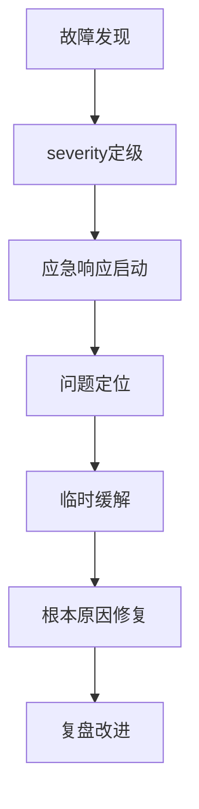

# 🚀 部署与运维规则

## 1. 文档目的
建立标准化的部署流程和运维标准，确保应用发布过程可靠、可重复、可追溯。

## 2. 环境管理规范

### 2.1 环境定义
```yaml
# 多环境配置标准
environments:
  development:
    目的: 开发联调
    数据: 模拟数据，可随时重置
    访问: 内网访问
    稳定性: 允许短暂不可用
    
  staging:
    目的: 集成测试，预发布验证
    数据: 脱敏生产数据副本
    访问: 受限外网访问
    稳定性: 要求高可用
    
  production:
    目的: 线上服务
    数据: 真实生产数据
    访问: 公开访问
    稳定性: 要求99.9%以上可用性
```

### 2.2 配置管理
**通用原则**：
- ✅ 配置与代码分离
- ✅ 环境特定配置通过环境变量注入
- ✅ 敏感配置使用密钥管理服务
- ❌ 禁止硬编码配置

**不同项目类型的配置方案**：
```yaml
# Web应用 (12-Factor App风格)
配置来源: 环境变量 + ConfigMap (K8s) / .env (本地开发)

# 移动应用
配置来源: 构建变体 + 远程配置 (Firebase Remote Config)
注意事项: 配置更新需考虑版本兼容性

# 游戏项目  
配置来源: 脚本ableObject (Unity) / 数据表 (Unreal) + 远程配置
注意事项: 热更新配置需考虑客户端版本碎片化
```

## 3. 部署流程规范

### 3.1 部署策略
| 策略 | 适用场景 | 风险等级 | 回滚难度 |
|------|----------|----------|----------|
| 蓝绿部署 | 关键业务应用 | 低 | 容易 |
| 金丝雀发布 | 用户量大的服务 | 中 | 中等 |
| 滚动更新 | 无状态服务 | 中低 | 中等 |
| 影子流量 | 数据迁移、性能测试 | 低 | 容易 |

### 3.2 部署检查清单
**通用检查项**：
- [ ] 代码已通过所有自动化测试
- [ ] 数据库迁移脚本已准备并测试
- [ ] 配置变更已审查
- [ ] 依赖服务可用性确认
- [ ] 监控告警已配置
- [ ] 回滚方案已验证

**项目类型特定检查**：
```yaml
Web应用:
  - [ ] CDN缓存刷新策略
  - [ ] 浏览器缓存控制头
  - [ ] API版本兼容性

移动应用:
  - [ ] 应用商店审核时间预留
  - [ ] 后端API版本兼容性
  - [ ] 强制更新机制(如需要)

游戏项目:
  - [ ] 资源热更新流程
  - [ ] 客户端版本兼容性
  - [ ] 存档数据迁移方案
```

## 4. 监控与告警规范

### 4.1 监控指标标准
**四大黄金指标**：
1. **流量** - QPS、并发用户数、下载量
2. **错误率** - HTTP错误率、业务异常率、崩溃率
3. **延迟** - API响应时间、渲染帧率、加载时间
4. **饱和度** - CPU、内存、磁盘、网络使用率

### 4.2 告警分级策略
```yaml
P0-紧急:
  条件: 核心功能完全不可用，影响所有用户
  响应: 立即处理，24x7响应
  示例: 服务503错误，数据库连接失败

P1-重要: 
  条件: 核心功能部分受损，影响大量用户
  响应: 2小时内处理
  示例: API响应时间超过阈值，错误率升高

P2-警告:
  条件: 非核心功能问题，影响有限用户
  响应: 24小时内处理
  示例: 缓存命中率下降，磁盘使用率预警
```

## 5. 故障处理规范

### 5.1 故障响应流程


### 5.2 故障报告模板
```markdown
# 故障报告: [故障标题]

## 故障概况
- 发生时间: 
- 持续时间: 
- 影响范围: 
- 故障等级: P0/P1/P2

## 时间线
| 时间 | 事件 |
|------|------|
| 14:00 | 监控告警触发 |
| 14:02 | 值班工程师确认 |
| 14:05 | 应急响应启动 |

## 根本原因
<!-- 技术层面的根本原因分析 -->

## 改进措施
- [ ] 短期措施 (24小时内)
- [ ] 长期措施 (2周内)
- [ ] 流程改进
```