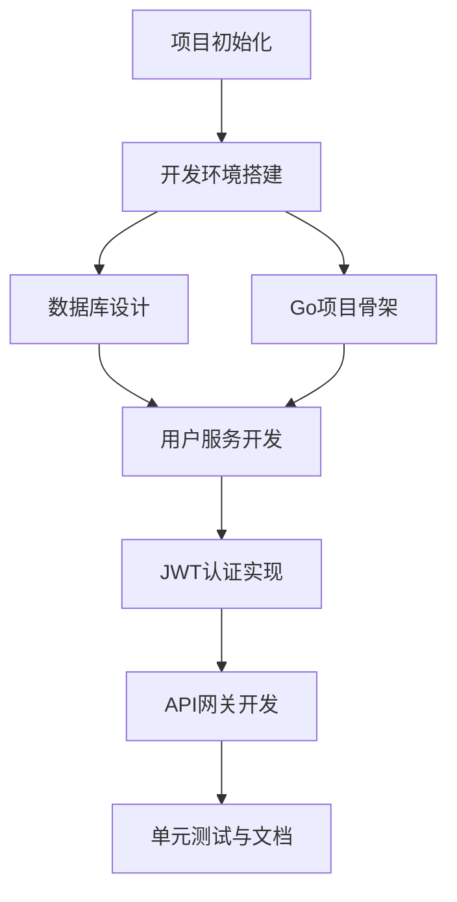

# M1阶段：基础框架开发任务

## 阶段信息
| 项目 | 内容 |
|------|------|
| 阶段代号 | M1 |
| 阶段名称 | 基础框架 |
| 预计周期 | 第1-8周（约2个月） |
| 核心目标 | 搭建项目骨架，完成用户系统 |

---

## 1. 阶段目标

### 1.1 交付物清单

- [x] 项目代码仓库与目录结构
- [x] Docker开发环境一键启动
- [x] 用户注册/登录/Token刷新API
- [x] JWT认证中间件
- [x] 核心数据库表结构与Migration
- [x] API网关统一入口
- [x] 基础日志与错误处理

### 1.2 验收标准

| 验收项 | 标准 |
|--------|------|
| 项目结构 | 后端/前端目录清晰，可构建 |
| 开发环境 | `docker-compose up -d` 一键启动所有依赖 |
| 用户注册 | POST /auth/register 正常返回 |
| 用户登录 | POST /auth/login 返回有效Token |
| Token刷新 | POST /auth/refresh 正常工作 |
| 认证保护 | 无Token访问受保护接口返回401 |

---

## 2. 任务拆解

### 2.1 任务依赖图



### 2.2 详细任务列表

---

#### T1: 项目初始化
**预计时间**: 1天

**输入契约**:
- 无

**输出契约**:
- Git仓库已创建
- 目录结构已建立
- .gitignore配置完成
- README.md已编写

**实现步骤**:
```bash
# 1. 创建项目根目录
mkdir unlimited-corp
cd unlimited-corp

# 2. 初始化Git
git init
git remote add origin <repo-url>

# 3. 创建目录结构
mkdir -p backend/{cmd,internal,pkg,migrations,configs,scripts}
mkdir -p frontend/src/{api,components,pages,stores,hooks,types,utils}
mkdir -p docs/{文档,约束,开发计划}
mkdir -p deploy/{docker,k8s}

# 4. 创建.gitignore
cat > .gitignore << 'EOF'
# Go
*.exe
*.exe~
*.dll
*.so
*.dylib
*.test
*.out
vendor/

# Node
node_modules/
dist/
.pnpm-store/

# IDE
.idea/
.vscode/
*.swp
*.swo

# Environment
.env
.env.local
*.local

# Build
build/
tmp/

# Logs
*.log
logs/
EOF

# 5. 创建README.md
echo "# 无限公司 Unlimited Corp." > README.md
```

**验收检查**:
- [ ] Git仓库可正常push/pull
- [ ] 目录结构符合规范
- [ ] .gitignore配置正确

---

#### T2: 开发环境搭建
**预计时间**: 2天

**输入契约**:
- T1完成

**输出契约**:
- docker-compose.yml已配置
- 所有服务可正常启动
- 端口映射正确

**实现步骤**:

1. 创建docker-compose.yml（参考02_技术栈与环境配置.md）
2. 创建.env.example
3. 测试启动

```bash
# 启动验证
docker-compose up -d
docker-compose ps
# 确认所有服务状态为running/healthy

# 验证PostgreSQL
psql -h localhost -U unlimited -d unlimited_corp

# 验证Redis
redis-cli ping

# 验证Temporal UI
# 访问 http://localhost:8080
```

**验收检查**:
- [ ] PostgreSQL可连接
- [ ] Redis可连接
- [ ] Kafka运行正常
- [ ] Temporal UI可访问
- [ ] MinIO可访问

---

#### T3: 数据库设计与迁移
**预计时间**: 3天

**输入契约**:
- T2完成
- 数据模型设计（参考02_技术架构文档.md）

**输出契约**:
- 核心表结构SQL脚本
- Migration脚本可执行
- 数据库初始化完成

**实现步骤**:

1. 创建Migration工具配置
```go
// backend/pkg/database/migrate.go
package database

import (
    "github.com/golang-migrate/migrate/v4"
    _ "github.com/golang-migrate/migrate/v4/database/postgres"
    _ "github.com/golang-migrate/migrate/v4/source/file"
)

func RunMigrations(dbURL string) error {
    m, err := migrate.New(
        "file://migrations",
        dbURL,
    )
    if err != nil {
        return err
    }
    return m.Up()
}
```

2. 创建初始Migration
```
backend/migrations/
├── 000001_init_schema.up.sql    # 创建表
├── 000001_init_schema.down.sql  # 回滚表
├── 000002_seed_data.up.sql      # 种子数据
└── 000002_seed_data.down.sql    # 清除种子数据
```

**表结构（详见02_技术栈与环境配置.md）**:
- users
- companies
- subscriptions
- skill_cards
- employee_templates
- employees
- skill_equips
- workflow_templates
- tasks
- task_steps
- task_assignments

**验收检查**:
- [ ] Migration可正常执行
- [ ] 所有表创建成功
- [ ] 索引创建正确
- [ ] 可回滚Migration

---

#### T4: Go项目骨架
**预计时间**: 2天

**输入契约**:
- T1完成

**输出契约**:
- Go模块初始化完成
- 项目目录结构完善
- 基础配置框架搭建

**实现步骤**:

1. 初始化Go模块
```bash
cd backend
go mod init github.com/unlimited-corp/backend
```

2. 创建配置管理
```go
// backend/pkg/config/config.go
package config

type Config struct {
    App      AppConfig
    Database DatabaseConfig
    Redis    RedisConfig
    JWT      JWTConfig
    AI       AIConfig
}

type AppConfig struct {
    Env    string `mapstructure:"APP_ENV"`
    Port   int    `mapstructure:"APP_PORT"`
    Secret string `mapstructure:"APP_SECRET"`
}

// ... 其他配置结构
```

3. 创建日志模块
```go
// backend/pkg/logger/logger.go
package logger

import "go.uber.org/zap"

var Log *zap.Logger

func Init(env string) error {
    var err error
    if env == "production" {
        Log, err = zap.NewProduction()
    } else {
        Log, err = zap.NewDevelopment()
    }
    return err
}
```

4. 创建基础HTTP框架
```go
// backend/internal/handler/router.go
package handler

import (
    "github.com/gin-gonic/gin"
)

func SetupRouter() *gin.Engine {
    r := gin.Default()
    
    // 健康检查
    r.GET("/health", func(c *gin.Context) {
        c.JSON(200, gin.H{"status": "ok"})
    })
    
    // API v1 路由组
    v1 := r.Group("/api/v1")
    {
        // 将在后续任务中添加具体路由
    }
    
    return r
}
```

**验收检查**:
- [ ] `go mod tidy` 无报错
- [ ] `go build ./...` 成功
- [ ] 配置可正常加载
- [ ] 日志可正常输出

---

#### T5: 用户服务开发
**预计时间**: 5天

**输入契约**:
- T3, T4完成
- API规格文档（认证模块）

**输出契约**:
- 用户注册API
- 用户登录API
- 获取用户信息API
- 公司自动创建逻辑

**实现步骤**:

1. 创建领域模型
```go
// backend/internal/domain/user.go
package domain

type User struct {
    ID           string    `json:"id"`
    Email        string    `json:"email"`
    PasswordHash string    `json:"-"`
    Nickname     string    `json:"nickname"`
    AvatarURL    string    `json:"avatarUrl"`
    Status       string    `json:"status"`
    CreatedAt    time.Time `json:"createdAt"`
    UpdatedAt    time.Time `json:"updatedAt"`
}

type Company struct {
    ID          string    `json:"id"`
    UserID      string    `json:"userId"`
    Name        string    `json:"name"`
    Description string    `json:"description"`
    Status      string    `json:"status"`
    CreatedAt   time.Time `json:"createdAt"`
}

type Subscription struct {
    ID            string    `json:"id"`
    CompanyID     string    `json:"companyId"`
    PlanType      string    `json:"planType"`
    MaxEmployees  int       `json:"maxEmployees"`
    MaxSkillCards int       `json:"maxSkillCards"`
    ExpiresAt     time.Time `json:"expiresAt,omitempty"`
}
```

2. 创建Repository
```go
// backend/internal/repository/user_repo.go
package repository

type UserRepository interface {
    Create(ctx context.Context, user *domain.User) error
    GetByEmail(ctx context.Context, email string) (*domain.User, error)
    GetByID(ctx context.Context, id string) (*domain.User, error)
    Update(ctx context.Context, user *domain.User) error
}

type CompanyRepository interface {
    Create(ctx context.Context, company *domain.Company) error
    GetByUserID(ctx context.Context, userID string) (*domain.Company, error)
}

type SubscriptionRepository interface {
    Create(ctx context.Context, sub *domain.Subscription) error
    GetByCompanyID(ctx context.Context, companyID string) (*domain.Subscription, error)
}
```

3. 创建Service
```go
// backend/internal/service/user_service.go
package service

type RegisterRequest struct {
    Email      string `json:"email" binding:"required,email"`
    Password   string `json:"password" binding:"required,min=8"`
    Nickname   string `json:"nickname"`
    InviteCode string `json:"inviteCode"`
}

type LoginRequest struct {
    Email    string `json:"email" binding:"required,email"`
    Password string `json:"password" binding:"required"`
}

type UserService interface {
    Register(ctx context.Context, req *RegisterRequest) (*RegisterResponse, error)
    Login(ctx context.Context, req *LoginRequest) (*LoginResponse, error)
    GetProfile(ctx context.Context, userID string) (*UserProfile, error)
}
```

4. 创建Handler
```go
// backend/internal/handler/auth_handler.go
package handler

func (h *AuthHandler) Register(c *gin.Context) {
    var req service.RegisterRequest
    if err := c.ShouldBindJSON(&req); err != nil {
        c.JSON(400, gin.H{"code": 40001, "message": err.Error()})
        return
    }
    
    resp, err := h.userService.Register(c.Request.Context(), &req)
    if err != nil {
        // 处理业务错误
        return
    }
    
    c.JSON(200, gin.H{"code": 0, "message": "success", "data": resp})
}
```

**API接口**:
| 方法 | 路径 | 说明 |
|------|------|------|
| POST | /api/v1/auth/register | 用户注册 |
| POST | /api/v1/auth/login | 用户登录 |
| GET | /api/v1/users/me | 获取当前用户信息 |

**验收检查**:
- [ ] 注册成功创建用户、公司、订阅
- [ ] 登录返回有效Token
- [ ] 密码加密存储（bcrypt）
- [ ] 邮箱重复检测正确
- [ ] 单元测试覆盖率 > 80%

---

#### T6: JWT认证实现
**预计时间**: 2天

**输入契约**:
- T5完成

**输出契约**:
- JWT生成逻辑
- JWT验证中间件
- Token刷新API

**实现步骤**:

1. JWT工具
```go
// backend/pkg/jwt/jwt.go
package jwt

type Claims struct {
    UserID    string `json:"sub"`
    CompanyID string `json:"company_id"`
    PlanType  string `json:"plan"`
    jwt.RegisteredClaims
}

func GenerateTokens(user *domain.User, company *domain.Company, sub *domain.Subscription) (*TokenPair, error) {
    // 生成access token (2小时)
    // 生成refresh token (7天)
}

func ValidateToken(tokenString string) (*Claims, error) {
    // 验证并解析token
}
```

2. 认证中间件
```go
// backend/internal/middleware/auth.go
package middleware

func AuthRequired() gin.HandlerFunc {
    return func(c *gin.Context) {
        authHeader := c.GetHeader("Authorization")
        if authHeader == "" {
            c.AbortWithStatusJSON(401, gin.H{
                "code": 40101, 
                "message": "Unauthorized",
            })
            return
        }
        
        tokenString := strings.TrimPrefix(authHeader, "Bearer ")
        claims, err := jwt.ValidateToken(tokenString)
        if err != nil {
            c.AbortWithStatusJSON(401, gin.H{
                "code": 40102, 
                "message": "Invalid or expired token",
            })
            return
        }
        
        c.Set("user_id", claims.UserID)
        c.Set("company_id", claims.CompanyID)
        c.Set("plan_type", claims.PlanType)
        c.Next()
    }
}
```

3. Token刷新
```go
// POST /api/v1/auth/refresh
func (h *AuthHandler) RefreshToken(c *gin.Context) {
    var req RefreshRequest
    if err := c.ShouldBindJSON(&req); err != nil {
        c.JSON(400, gin.H{"code": 40001, "message": err.Error()})
        return
    }
    
    tokens, err := h.authService.RefreshTokens(c.Request.Context(), req.RefreshToken)
    if err != nil {
        c.JSON(401, gin.H{"code": 40102, "message": "Invalid refresh token"})
        return
    }
    
    c.JSON(200, gin.H{"code": 0, "message": "success", "data": tokens})
}
```

**验收检查**:
- [ ] Access Token 2小时过期
- [ ] Refresh Token 7天过期
- [ ] 无Token返回401
- [ ] 过期Token返回401
- [ ] 刷新Token正常工作

---

#### T7: API网关开发
**预计时间**: 2天

**输入契约**:
- T5, T6完成

**输出契约**:
- 统一路由配置
- 统一响应格式
- 请求日志
- 错误处理

**实现步骤**:

1. 统一响应格式
```go
// backend/pkg/response/response.go
package response

type Response struct {
    Code      int         `json:"code"`
    Message   string      `json:"message"`
    Data      interface{} `json:"data,omitempty"`
    Timestamp int64       `json:"timestamp"`
    RequestID string      `json:"requestId,omitempty"`
}

func Success(c *gin.Context, data interface{}) {
    c.JSON(200, Response{
        Code:      0,
        Message:   "success",
        Data:      data,
        Timestamp: time.Now().UnixMilli(),
        RequestID: c.GetString("request_id"),
    })
}

func Error(c *gin.Context, code int, message string) {
    c.JSON(getHTTPStatus(code), Response{
        Code:      code,
        Message:   message,
        Timestamp: time.Now().UnixMilli(),
        RequestID: c.GetString("request_id"),
    })
}
```

2. 请求ID中间件
```go
// backend/internal/middleware/request_id.go
func RequestID() gin.HandlerFunc {
    return func(c *gin.Context) {
        requestID := c.GetHeader("X-Request-ID")
        if requestID == "" {
            requestID = uuid.New().String()
        }
        c.Set("request_id", requestID)
        c.Header("X-Request-ID", requestID)
        c.Next()
    }
}
```

3. 请求日志中间件
```go
// backend/internal/middleware/logger.go
func Logger() gin.HandlerFunc {
    return func(c *gin.Context) {
        start := time.Now()
        path := c.Request.URL.Path
        
        c.Next()
        
        latency := time.Since(start)
        logger.Log.Info("HTTP Request",
            zap.String("method", c.Request.Method),
            zap.String("path", path),
            zap.Int("status", c.Writer.Status()),
            zap.Duration("latency", latency),
            zap.String("request_id", c.GetString("request_id")),
        )
    }
}
```

4. 路由整合
```go
// backend/cmd/gateway/main.go
func main() {
    // 初始化配置
    cfg := config.Load()
    
    // 初始化日志
    logger.Init(cfg.App.Env)
    
    // 初始化数据库
    db := database.Connect(cfg.Database)
    
    // 初始化服务
    userService := service.NewUserService(...)
    
    // 初始化Handler
    authHandler := handler.NewAuthHandler(userService)
    
    // 设置路由
    r := gin.New()
    r.Use(middleware.RequestID())
    r.Use(middleware.Logger())
    r.Use(middleware.Recovery())
    r.Use(middleware.CORS())
    
    r.GET("/health", func(c *gin.Context) {
        response.Success(c, gin.H{"status": "ok"})
    })
    
    v1 := r.Group("/api/v1")
    {
        auth := v1.Group("/auth")
        {
            auth.POST("/register", authHandler.Register)
            auth.POST("/login", authHandler.Login)
            auth.POST("/refresh", authHandler.RefreshToken)
        }
        
        // 需要认证的路由
        protected := v1.Group("")
        protected.Use(middleware.AuthRequired())
        {
            protected.GET("/users/me", authHandler.GetProfile)
        }
    }
    
    r.Run(fmt.Sprintf(":%d", cfg.App.Port))
}
```

**验收检查**:
- [ ] 所有响应格式统一
- [ ] 请求ID正确生成和传递
- [ ] 请求日志记录完整
- [ ] CORS配置正确
- [ ] 错误处理统一

---

#### T8: 单元测试与文档
**预计时间**: 2天

**输入契约**:
- T5-T7完成

**输出契约**:
- 单元测试覆盖
- API文档
- 部署说明

**实现步骤**:

1. 编写单元测试
```go
// backend/internal/service/user_service_test.go
func TestUserService_Register(t *testing.T) {
    // 测试正常注册
    // 测试邮箱重复
    // 测试密码过短
}

func TestUserService_Login(t *testing.T) {
    // 测试正常登录
    // 测试密码错误
    // 测试用户不存在
}
```

2. 编写集成测试
```go
// backend/internal/handler/auth_handler_test.go
func TestAuthHandler_Register_Integration(t *testing.T) {
    // 使用testcontainers启动PostgreSQL
    // 测试完整注册流程
}
```

3. 生成API文档（使用Swagger）
```go
// backend/docs/swagger.yaml
// 或使用swag工具自动生成
```

**验收检查**:
- [ ] 单元测试覆盖率 > 70%
- [ ] 集成测试通过
- [ ] API文档完整
- [ ] README更新

---

## 3. 技术要点

### 3.1 密码加密
使用bcrypt，cost=12
```go
import "golang.org/x/crypto/bcrypt"

func HashPassword(password string) (string, error) {
    bytes, err := bcrypt.GenerateFromPassword([]byte(password), 12)
    return string(bytes), err
}

func CheckPassword(password, hash string) bool {
    err := bcrypt.CompareHashAndPassword([]byte(hash), []byte(password))
    return err == nil
}
```

### 3.2 事务处理
注册时需要事务保证数据一致性（用户+公司+订阅）
```go
tx, err := db.BeginTx(ctx, nil)
defer tx.Rollback()

// 创建用户
// 创建公司
// 创建订阅

tx.Commit()
```

---

## 4. 进度跟踪

| 任务 | 状态 | 开始时间 | 完成时间 | 备注 |
|------|------|----------|----------|------|
| T1: 项目初始化 | PENDING | - | - | - |
| T2: 开发环境搭建 | PENDING | - | - | - |
| T3: 数据库设计 | PENDING | - | - | - |
| T4: Go项目骨架 | PENDING | - | - | - |
| T5: 用户服务开发 | PENDING | - | - | - |
| T6: JWT认证实现 | PENDING | - | - | - |
| T7: API网关开发 | PENDING | - | - | - |
| T8: 单元测试与文档 | PENDING | - | - | - |

---

*文档结束*
