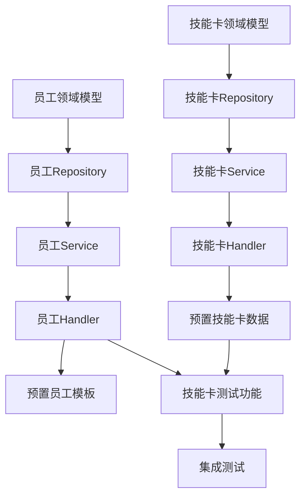

# M2阶段：核心系统开发任务

## 阶段信息
| 项目 | 内容 |
|------|------|
| 阶段代号 | M2 |
| 阶段名称 | 核心系统 |
| 预计周期 | 第9-16周（约2个月） |
| 核心目标 | 完成技能卡系统和员工系统 |

---

## 1. 阶段目标

### 1.1 交付物清单

- [ ] 技能卡CRUD完整API
- [ ] 3个预置技能卡（热点分析、文案生成、配图生成）
- [ ] 员工招募/解雇API
- [ ] 技能卡装备/卸载API
- [ ] 5个预置员工模板
- [ ] 员工状态管理

### 1.2 验收标准

| 验收项 | 标准 |
|--------|------|
| 技能卡列表 | 可获取技能卡列表，支持分页筛选 |
| 技能卡详情 | 可获取完整技能卡信息 |
| 技能卡测试 | 可在线测试技能卡执行 |
| 员工招募 | 可从模板招募员工 |
| 技能装备 | 可为员工装备技能卡 |
| 员工状态 | 正确显示空闲/工作中状态 |

---

## 2. 任务拆解

### 2.1 任务依赖图



### 2.2 详细任务列表

---

#### T1: 技能卡领域模型
**预计时间**: 1天

**输出契约**:
```go
// backend/internal/domain/skillcard.go
package domain

type SkillCard struct {
    ID           string                 `json:"id"`
    Name         string                 `json:"name"`
    Description  string                 `json:"description"`
    Category     SkillCategory          `json:"category"`
    InputSchema  map[string]interface{} `json:"inputSchema"`
    OutputSchema map[string]interface{} `json:"outputSchema"`
    KernelType   string                 `json:"kernelType"`
    KernelConfig SkillKernelConfig      `json:"kernelConfig"`
    CreatorID    string                 `json:"creatorId"`
    IsPublic     bool                   `json:"isPublic"`
    IsSystem     bool                   `json:"isSystem"`
    Price        float64                `json:"price"`
    PriceType    string                 `json:"priceType"`
    Status       string                 `json:"status"`
    Version      int                    `json:"version"`
    IconURL      string                 `json:"iconUrl"`
    Tags         []string               `json:"tags"`
    UsageCount   int                    `json:"usageCount"`
    Rating       float64                `json:"rating"`
    RatingCount  int                    `json:"ratingCount"`
    CreatedAt    time.Time              `json:"createdAt"`
    UpdatedAt    time.Time              `json:"updatedAt"`
}

type SkillCategory string

const (
    CategoryCreative   SkillCategory = "creative"
    CategoryCollection SkillCategory = "collection"
    CategoryContent    SkillCategory = "content"
    CategoryVisual     SkillCategory = "visual"
    CategoryOptimize   SkillCategory = "optimize"
    CategoryPublish    SkillCategory = "publish"
    CategoryDelivery   SkillCategory = "delivery"
)

type SkillKernelConfig struct {
    // AI模型类型
    ModelID            string  `json:"modelId,omitempty"`
    SystemPrompt       string  `json:"systemPrompt,omitempty"`
    UserPromptTemplate string  `json:"userPromptTemplate,omitempty"`
    Temperature        float64 `json:"temperature,omitempty"`
    MaxTokens          int     `json:"maxTokens,omitempty"`
    
    // 代码逻辑类型
    Runtime      string   `json:"runtime,omitempty"`
    Code         string   `json:"code,omitempty"`
    Dependencies []string `json:"dependencies,omitempty"`
}

type SkillCardOwnership struct {
    ID           string    `json:"id"`
    CompanyID    string    `json:"companyId"`
    SkillCardID  string    `json:"skillCardId"`
    AcquiredType string    `json:"acquiredType"`
    AcquiredAt   time.Time `json:"acquiredAt"`
    ExpiresAt    time.Time `json:"expiresAt,omitempty"`
}
```

---

#### T2: 技能卡Repository
**预计时间**: 2天

```go
// backend/internal/repository/skillcard_repo.go
type SkillCardRepository interface {
    Create(ctx context.Context, card *domain.SkillCard) error
    GetByID(ctx context.Context, id string) (*domain.SkillCard, error)
    Update(ctx context.Context, card *domain.SkillCard) error
    Delete(ctx context.Context, id string) error
    List(ctx context.Context, filter *SkillCardFilter) ([]*domain.SkillCard, int, error)
    IncrementUsage(ctx context.Context, id string) error
}

type SkillCardFilter struct {
    Category  string
    Status    string
    Keyword   string
    CreatorID string
    IsPublic  *bool
    Page      int
    PageSize  int
}

type SkillCardOwnershipRepository interface {
    Create(ctx context.Context, ownership *domain.SkillCardOwnership) error
    GetByCompanyAndCard(ctx context.Context, companyID, cardID string) (*domain.SkillCardOwnership, error)
    ListByCompany(ctx context.Context, companyID string) ([]*domain.SkillCardOwnership, error)
    Delete(ctx context.Context, id string) error
}
```

---

#### T3: 技能卡Service
**预计时间**: 2天

```go
// backend/internal/service/skillcard_service.go
type SkillCardService interface {
    // 技能卡CRUD
    Create(ctx context.Context, creatorID string, req *CreateSkillCardRequest) (*domain.SkillCard, error)
    GetByID(ctx context.Context, id string, userID string) (*SkillCardDetail, error)
    Update(ctx context.Context, id string, userID string, req *UpdateSkillCardRequest) (*domain.SkillCard, error)
    Delete(ctx context.Context, id string, userID string) error
    List(ctx context.Context, filter *SkillCardFilter, userID string) (*SkillCardListResponse, error)
    
    // 技能卡测试
    Test(ctx context.Context, id string, userID string, input map[string]interface{}) (*SkillTestResult, error)
    
    // 公司技能卡管理
    GetOwnedCards(ctx context.Context, companyID string) ([]*domain.SkillCard, error)
    AcquireCard(ctx context.Context, companyID string, cardID string) error
}

type CreateSkillCardRequest struct {
    Name         string                 `json:"name" binding:"required,max=100"`
    Description  string                 `json:"description"`
    Category     string                 `json:"category" binding:"required"`
    InputSchema  map[string]interface{} `json:"inputSchema" binding:"required"`
    OutputSchema map[string]interface{} `json:"outputSchema" binding:"required"`
    KernelType   string                 `json:"kernelType" binding:"required,oneof=ai_model code_logic"`
    KernelConfig domain.SkillKernelConfig `json:"kernelConfig" binding:"required"`
    IconURL      string                 `json:"iconUrl"`
    Tags         []string               `json:"tags"`
}

type SkillTestResult struct {
    TestID        string                 `json:"testId"`
    Status        string                 `json:"status"`
    Input         map[string]interface{} `json:"input"`
    Output        map[string]interface{} `json:"output,omitempty"`
    Error         string                 `json:"error,omitempty"`
    ExecutionTime int64                  `json:"executionTime"`
    TokensUsed    int                    `json:"tokensUsed,omitempty"`
    ExecutedAt    time.Time              `json:"executedAt"`
}
```

---

#### T4: 技能卡Handler
**预计时间**: 2天

```go
// backend/internal/handler/skillcard_handler.go
type SkillCardHandler struct {
    skillCardService service.SkillCardService
}

func (h *SkillCardHandler) RegisterRoutes(g *gin.RouterGroup) {
    cards := g.Group("/skillcards")
    {
        cards.GET("", h.List)           // GET /api/v1/skillcards
        cards.GET("/:id", h.GetByID)    // GET /api/v1/skillcards/:id
        cards.POST("", h.Create)        // POST /api/v1/skillcards
        cards.PUT("/:id", h.Update)     // PUT /api/v1/skillcards/:id
        cards.DELETE("/:id", h.Delete)  // DELETE /api/v1/skillcards/:id
        cards.POST("/:id/test", h.Test) // POST /api/v1/skillcards/:id/test
    }
}
```

**API实现要点**:
- List支持分页和多条件筛选
- GetByID返回完整详情，包含已装备员工信息
- Create时校验JSON Schema格式
- Test时调用AI Gateway执行

---

#### T5: 预置技能卡数据
**预计时间**: 1天

创建3个系统预置技能卡：

```sql
-- migrations/000002_seed_data.up.sql

-- 1. 热点分析器
INSERT INTO skill_cards (id, name, description, category, input_schema, output_schema, 
    kernel_type, kernel_config, is_public, is_system, status, icon_url, tags) VALUES
(
    'skc_hotspot_001',
    '热点分析器',
    '分析当前热门话题和趋势，为内容创作提供方向',
    'creative',
    '{
        "type": "object",
        "required": ["platform"],
        "properties": {
            "platform": {"type": "string", "title": "目标平台", "enum": ["xiaohongshu", "douyin", "weibo"]},
            "category": {"type": "string", "title": "内容类别"}
        }
    }',
    '{
        "type": "object",
        "properties": {
            "topic": {"type": "string", "title": "热门话题"},
            "keywords": {"type": "array", "items": {"type": "string"}, "title": "关键词"},
            "trend": {"type": "string", "title": "趋势分析"},
            "suggestions": {"type": "array", "items": {"type": "string"}, "title": "创作建议"}
        }
    }',
    'ai_model',
    '{
        "modelId": "gpt-4o",
        "systemPrompt": "你是一个专业的社交媒体热点分析师...",
        "userPromptTemplate": "请分析{{input.platform}}平台{{input.category}}类别的当前热点...",
        "temperature": 0.7,
        "maxTokens": 1000
    }',
    true, true, 'published',
    '/icons/hotspot.png',
    ARRAY['热点', '分析', '趋势']
);

-- 2. 小红书笔记生成器
INSERT INTO skill_cards (id, name, description, category, input_schema, output_schema,
    kernel_type, kernel_config, is_public, is_system, status, icon_url, tags) VALUES
(
    'skc_xiaohongshu_001',
    '小红书笔记生成器',
    '根据主题自动生成小红书风格的种草笔记',
    'content',
    '{
        "type": "object",
        "required": ["topic"],
        "properties": {
            "topic": {"type": "string", "title": "主题", "maxLength": 100},
            "style": {"type": "string", "title": "风格", "enum": ["种草", "测评", "教程", "日常"], "default": "种草"},
            "keywords": {"type": "array", "items": {"type": "string"}, "title": "关键词", "maxItems": 5},
            "wordCount": {"type": "integer", "title": "字数", "minimum": 100, "maximum": 1000, "default": 300}
        }
    }',
    '{
        "type": "object",
        "properties": {
            "title": {"type": "string", "title": "标题"},
            "content": {"type": "string", "title": "正文"},
            "tags": {"type": "array", "items": {"type": "string"}, "title": "标签"},
            "emojis": {"type": "array", "items": {"type": "string"}, "title": "推荐表情"}
        }
    }',
    'ai_model',
    '{
        "modelId": "gpt-4o",
        "systemPrompt": "你是一个小红书爆款内容创作者...",
        "userPromptTemplate": "请根据以下要求创作小红书笔记：\n主题：{{input.topic}}\n风格：{{input.style}}\n字数：{{input.wordCount}}字左右",
        "temperature": 0.8,
        "maxTokens": 2000
    }',
    true, true, 'published',
    '/icons/xiaohongshu.png',
    ARRAY['小红书', '种草', '文案']
);

-- 3. AI配图生成器
INSERT INTO skill_cards (id, name, description, category, input_schema, output_schema,
    kernel_type, kernel_config, is_public, is_system, status, icon_url, tags) VALUES
(
    'skc_image_001',
    'AI配图生成器',
    '根据文案内容自动生成配套图片',
    'visual',
    '{
        "type": "object",
        "required": ["description"],
        "properties": {
            "description": {"type": "string", "title": "图片描述", "maxLength": 500},
            "style": {"type": "string", "title": "风格", "enum": ["摄影", "插画", "3D", "扁平"], "default": "摄影"},
            "size": {"type": "string", "title": "尺寸", "enum": ["1:1", "4:3", "16:9", "9:16"], "default": "1:1"}
        }
    }',
    '{
        "type": "object",
        "properties": {
            "imageUrl": {"type": "string", "title": "图片链接"},
            "revisedPrompt": {"type": "string", "title": "优化后的提示词"}
        }
    }',
    'ai_model',
    '{
        "modelId": "dall-e-3",
        "temperature": 0.7
    }',
    true, true, 'published',
    '/icons/image-gen.png',
    ARRAY['图片', '配图', 'AI生成']
);
```

---

#### T6: 员工领域模型
**预计时间**: 1天

```go
// backend/internal/domain/employee.go
package domain

type EmployeeTemplate struct {
    ID                string                 `json:"id"`
    Name              string                 `json:"name"`
    AvatarURL         string                 `json:"avatarUrl"`
    Personality       EmployeePersonality    `json:"personality"`
    Introduction      string                 `json:"introduction"`
    Rarity            string                 `json:"rarity"`
    RecommendedSkills []string               `json:"recommendedSkills"`
    CreatedAt         time.Time              `json:"createdAt"`
}

type EmployeePersonality struct {
    Trait       string `json:"trait"`
    Description string `json:"description"`
}

type Employee struct {
    ID          string              `json:"id"`
    CompanyID   string              `json:"companyId"`
    TemplateID  string              `json:"templateId"`
    Name        string              `json:"name"`
    AvatarURL   string              `json:"avatarUrl"`
    Status      EmployeeStatus      `json:"status"`
    PositionX   int                 `json:"positionX"`
    PositionY   int                 `json:"positionY"`
    Performance EmployeePerformance `json:"performance"`
    CreatedAt   time.Time           `json:"createdAt"`
    UpdatedAt   time.Time           `json:"updatedAt"`
}

type EmployeeStatus string

const (
    StatusIdle    EmployeeStatus = "idle"
    StatusWorking EmployeeStatus = "working"
)

type EmployeePerformance struct {
    TodayTasks     int     `json:"todayTasks"`
    WeekTasks      int     `json:"weekTasks"`
    TotalTasks     int     `json:"totalTasks"`
    SuccessRate    float64 `json:"successRate"`
    AvgExecutionTime int   `json:"avgExecutionTime"`
}

type SkillEquip struct {
    ID          string    `json:"id"`
    EmployeeID  string    `json:"employeeId"`
    SkillCardID string    `json:"skillCardId"`
    EquippedAt  time.Time `json:"equippedAt"`
}
```

---

#### T7-T9: 员工Repository/Service/Handler
**预计时间**: 4天

```go
// Repository
type EmployeeRepository interface {
    Create(ctx context.Context, emp *domain.Employee) error
    GetByID(ctx context.Context, id string) (*domain.Employee, error)
    Update(ctx context.Context, emp *domain.Employee) error
    Delete(ctx context.Context, id string) error
    ListByCompany(ctx context.Context, companyID string, filter *EmployeeFilter) ([]*domain.Employee, error)
    CountByCompany(ctx context.Context, companyID string) (int, error)
    UpdateStatus(ctx context.Context, id string, status domain.EmployeeStatus) error
}

type EmployeeTemplateRepository interface {
    GetByID(ctx context.Context, id string) (*domain.EmployeeTemplate, error)
    List(ctx context.Context) ([]*domain.EmployeeTemplate, error)
}

type SkillEquipRepository interface {
    Create(ctx context.Context, equip *domain.SkillEquip) error
    GetByEmployeeID(ctx context.Context, employeeID string) (*domain.SkillEquip, error)
    Delete(ctx context.Context, employeeID string) error
}

// Service
type EmployeeService interface {
    // 员工管理
    Recruit(ctx context.Context, companyID string, req *RecruitRequest) (*domain.Employee, error)
    Dismiss(ctx context.Context, employeeID string, companyID string, force bool) error
    List(ctx context.Context, companyID string, filter *EmployeeFilter) (*EmployeeListResponse, error)
    GetByID(ctx context.Context, employeeID string, companyID string) (*EmployeeDetail, error)
    UpdatePosition(ctx context.Context, employeeID string, companyID string, x, y int) error
    
    // 技能装备
    EquipSkill(ctx context.Context, employeeID string, companyID string, skillCardID string) error
    UnequipSkill(ctx context.Context, employeeID string, companyID string) error
    
    // 人才市场
    GetTemplates(ctx context.Context, planType string) ([]*domain.EmployeeTemplate, error)
}

// Handler Routes
func (h *EmployeeHandler) RegisterRoutes(g *gin.RouterGroup) {
    employees := g.Group("/employees")
    {
        employees.GET("", h.List)                      // GET /api/v1/employees
        employees.GET("/:id", h.GetByID)               // GET /api/v1/employees/:id
        employees.POST("", h.Recruit)                  // POST /api/v1/employees
        employees.DELETE("/:id", h.Dismiss)            // DELETE /api/v1/employees/:id
        employees.PUT("/:id/position", h.UpdatePosition) // PUT /api/v1/employees/:id/position
        employees.POST("/:id/equip", h.EquipSkill)     // POST /api/v1/employees/:id/equip
        employees.DELETE("/:id/equip", h.UnequipSkill) // DELETE /api/v1/employees/:id/equip
    }
    
    talent := g.Group("/talent-market")
    {
        talent.GET("", h.GetTemplates)  // GET /api/v1/talent-market
    }
}
```

**业务规则实现**:
- 招募时检查员工数量限制（免费版≤5）
- 装备技能时检查员工是否在工作中
- 解雇时检查员工状态，工作中需force=true
- 一个员工只能装备一张技能卡

---

#### T10: 预置员工模板
**预计时间**: 1天

```sql
-- 5个预置员工模板
INSERT INTO employee_templates (id, name, avatar_url, personality, introduction, rarity, recommended_skills) VALUES
(
    'tpl_writer_01',
    '文案小能手',
    '/avatars/writer.png',
    '{"trait": "diligent", "description": "勤奋踏实，执行力强"}',
    '擅长文字工作，是内容创作的好帮手',
    'common',
    ARRAY['content', 'optimize']
),
(
    'tpl_analyst_01',
    '数据分析师',
    '/avatars/analyst.png',
    '{"trait": "analytical", "description": "逻辑清晰，善于洞察"}',
    '擅长数据分析，能够发现隐藏的规律',
    'common',
    ARRAY['creative', 'collection']
),
(
    'tpl_designer_01',
    '创意设计师',
    '/avatars/designer.png',
    '{"trait": "creative", "description": "富有创意，审美独特"}',
    '视觉设计领域的专家，让作品更有美感',
    'rare',
    ARRAY['visual']
),
(
    'tpl_editor_01',
    '内容编辑',
    '/avatars/editor.png',
    '{"trait": "meticulous", "description": "细心认真，追求完美"}',
    '擅长内容优化和质量把控',
    'common',
    ARRAY['optimize', 'content']
),
(
    'tpl_publisher_01',
    '发布运营官',
    '/avatars/publisher.png',
    '{"trait": "efficient", "description": "高效敏捷，执行力强"}',
    '擅长多平台内容分发和运营',
    'common',
    ARRAY['publish', 'delivery']
);
```

---

#### T11: 技能卡测试功能
**预计时间**: 2天

实现技能卡在线测试：

```go
// backend/internal/service/skill_executor.go
type SkillExecutor interface {
    Execute(ctx context.Context, card *domain.SkillCard, input map[string]interface{}) (*ExecutionResult, error)
}

type AISkillExecutor struct {
    aiClient *ai.Client
    logger   *zap.Logger
}

func (e *AISkillExecutor) Execute(ctx context.Context, card *domain.SkillCard, input map[string]interface{}) (*ExecutionResult, error) {
    start := time.Now()
    
    // 1. 渲染提示词模板
    prompt, err := e.renderPrompt(card.KernelConfig.UserPromptTemplate, input)
    if err != nil {
        return nil, fmt.Errorf("render prompt failed: %w", err)
    }
    
    // 2. 调用AI模型
    resp, err := e.aiClient.ChatCompletion(ctx, &ai.ChatRequest{
        Model:       card.KernelConfig.ModelID,
        Messages: []ai.Message{
            {Role: "system", Content: card.KernelConfig.SystemPrompt},
            {Role: "user", Content: prompt},
        },
        Temperature: card.KernelConfig.Temperature,
        MaxTokens:   card.KernelConfig.MaxTokens,
    })
    if err != nil {
        return nil, fmt.Errorf("ai call failed: %w", err)
    }
    
    // 3. 解析输出
    output, err := e.parseOutput(resp.Content, card.OutputSchema)
    if err != nil {
        return nil, fmt.Errorf("parse output failed: %w", err)
    }
    
    return &ExecutionResult{
        Output:        output,
        TokensUsed:    resp.Usage.TotalTokens,
        ExecutionTime: time.Since(start).Milliseconds(),
    }, nil
}
```

---

#### T12: 集成测试
**预计时间**: 2天

- 技能卡CRUD完整流程测试
- 员工招募/解雇流程测试
- 技能装备/卸载流程测试
- 边界条件测试（员工数量限制、工作中解雇等）

---

## 3. 进度跟踪

| 任务 | 状态 | 开始时间 | 完成时间 | 备注 |
|------|------|----------|----------|------|
| T1: 技能卡领域模型 | PENDING | - | - | - |
| T2: 技能卡Repository | PENDING | - | - | - |
| T3: 技能卡Service | PENDING | - | - | - |
| T4: 技能卡Handler | PENDING | - | - | - |
| T5: 预置技能卡数据 | PENDING | - | - | - |
| T6: 员工领域模型 | PENDING | - | - | - |
| T7: 员工Repository | PENDING | - | - | - |
| T8: 员工Service | PENDING | - | - | - |
| T9: 员工Handler | PENDING | - | - | - |
| T10: 预置员工模板 | PENDING | - | - | - |
| T11: 技能卡测试功能 | PENDING | - | - | - |
| T12: 集成测试 | PENDING | - | - | - |

---

*文档结束*
