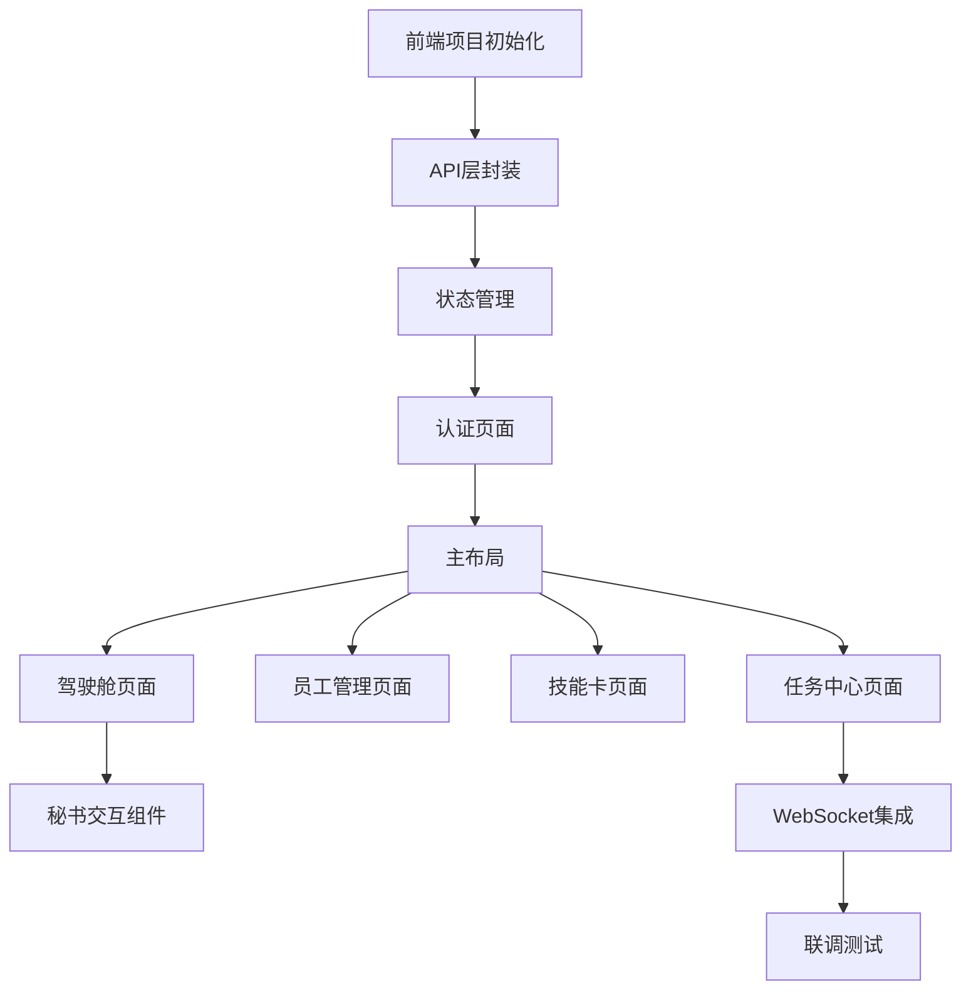

# M4阶段：前端整合开发任务

## 阶段信息
| 项目 | 内容 |
|------|------|
| 阶段代号 | M4 |
| 阶段名称 | 前端整合 |
| 预计周期 | 第27-35周（约2个月） |
| 核心目标 | 完成前端界面与系统联调 |

---

## 1. 阶段目标

### 1.1 交付物清单

- [ ] CEO驾驶舱首页
- [ ] 任务控制中心
- [ ] 员工管理界面
- [ ] 技能卡管理界面
- [ ] 私人秘书对话交互
- [ ] WebSocket实时通信
- [ ] 端到端测试通过

### 1.2 验收标准

| 验收项 | 标准 |
|--------|------|
| 驾驶舱 | 显示KPI、任务列表、活动流 |
| 任务中心 | 可查看任务列表和详情 |
| 员工管理 | 可招募、装备技能、查看状态 |
| 技能卡 | 可浏览、查看详情、测试 |
| 秘书交互 | 可发送指令、创建任务 |
| 实时更新 | 任务进度实时刷新 |

---

## 2. 前端架构设计

### 2.1 项目结构

```
frontend/
├── public/
│   ├── icons/                    # 图标资源
│   └── avatars/                  # 头像资源
├── src/
│   ├── api/                      # API请求
│   │   ├── client.ts             # Axios配置
│   │   ├── auth.ts               # 认证API
│   │   ├── skillcard.ts          # 技能卡API
│   │   ├── employee.ts           # 员工API
│   │   ├── task.ts               # 任务API
│   │   ├── workflow.ts           # 工作流API
│   │   ├── dashboard.ts          # 驾驶舱API
│   │   └── secretary.ts          # 秘书API
│   ├── components/
│   │   ├── ui/                   # 基础UI组件
│   │   │   ├── Button/
│   │   │   ├── Card/
│   │   │   ├── Modal/
│   │   │   └── ...
│   │   ├── layout/               # 布局组件
│   │   │   ├── Header/
│   │   │   ├── Sidebar/
│   │   │   └── MainLayout/
│   │   └── business/             # 业务组件
│   │       ├── SkillCardItem/
│   │       ├── EmployeeCard/
│   │       ├── TaskCard/
│   │       └── SecretaryChat/
│   ├── hooks/
│   │   ├── useAuth.ts
│   │   ├── useWebSocket.ts
│   │   └── useToast.ts
│   ├── pages/
│   │   ├── auth/
│   │   │   ├── Login/
│   │   │   └── Register/
│   │   ├── dashboard/
│   │   │   └── Dashboard/
│   │   ├── tasks/
│   │   │   ├── TaskList/
│   │   │   └── TaskDetail/
│   │   ├── employees/
│   │   │   ├── EmployeeList/
│   │   │   └── TalentMarket/
│   │   ├── skillcards/
│   │   │   ├── SkillCardList/
│   │   │   └── SkillCardDetail/
│   │   └── secretary/
│   │       └── SecretaryPanel/
│   ├── stores/
│   │   ├── authStore.ts
│   │   ├── employeeStore.ts
│   │   ├── taskStore.ts
│   │   └── notificationStore.ts
│   ├── types/
│   │   ├── api.ts
│   │   ├── user.ts
│   │   ├── skillcard.ts
│   │   ├── employee.ts
│   │   ├── task.ts
│   │   └── workflow.ts
│   ├── utils/
│   │   ├── format.ts
│   │   ├── storage.ts
│   │   └── constants.ts
│   ├── styles/
│   │   └── globals.css
│   ├── App.tsx
│   ├── main.tsx
│   └── router.tsx
├── package.json
├── tsconfig.json
├── tailwind.config.js
└── vite.config.ts
```

### 2.2 路由设计

```tsx
// src/router.tsx
const routes = [
  {
    path: '/login',
    element: <Login />,
  },
  {
    path: '/register',
    element: <Register />,
  },
  {
    path: '/',
    element: <MainLayout />,
    children: [
      { path: '', element: <Dashboard /> },
      { path: 'tasks', element: <TaskList /> },
      { path: 'tasks/:id', element: <TaskDetail /> },
      { path: 'employees', element: <EmployeeList /> },
      { path: 'talent-market', element: <TalentMarket /> },
      { path: 'skillcards', element: <SkillCardList /> },
      { path: 'skillcards/:id', element: <SkillCardDetail /> },
      { path: 'workflows', element: <WorkflowList /> },
    ],
  },
];
```

---

## 3. 任务拆解

### 3.1 任务依赖图



### 3.2 详细任务列表

---

#### T1: 前端项目初始化
**预计时间**: 2天

```bash
# 使用Vite创建React TypeScript项目
pnpm create vite frontend --template react-ts

# 安装核心依赖
cd frontend
pnpm add react-router-dom zustand axios @tanstack/react-query
pnpm add antd dayjs socket.io-client framer-motion
pnpm add -D tailwindcss postcss autoprefixer
pnpm add -D @types/node

# 初始化Tailwind
npx tailwindcss init -p
```

配置文件：
```ts
// vite.config.ts
import { defineConfig } from 'vite'
import react from '@vitejs/plugin-react'
import path from 'path'

export default defineConfig({
  plugins: [react()],
  resolve: {
    alias: {
      '@': path.resolve(__dirname, './src'),
    },
  },
  server: {
    port: 3000,
    proxy: {
      '/api': {
        target: 'http://localhost:8000',
        changeOrigin: true,
      },
      '/ws': {
        target: 'ws://localhost:8000',
        ws: true,
      },
    },
  },
})
```

---

#### T2: API层封装
**预计时间**: 2天

```ts
// src/api/client.ts
import axios, { AxiosInstance, AxiosError } from 'axios'
import { useAuthStore } from '@/stores/authStore'

const client: AxiosInstance = axios.create({
  baseURL: '/api/v1',
  timeout: 30000,
})

// 请求拦截器
client.interceptors.request.use((config) => {
  const token = useAuthStore.getState().accessToken
  if (token) {
    config.headers.Authorization = `Bearer ${token}`
  }
  config.headers['X-Request-ID'] = crypto.randomUUID()
  return config
})

// 响应拦截器
client.interceptors.response.use(
  (response) => response.data,
  async (error: AxiosError) => {
    if (error.response?.status === 401) {
      // 尝试刷新Token
      const refreshed = await useAuthStore.getState().refreshToken()
      if (refreshed && error.config) {
        return client.request(error.config)
      }
      useAuthStore.getState().logout()
    }
    return Promise.reject(error)
  }
)

export default client

// src/api/auth.ts
import client from './client'

export const authApi = {
  register: (data: RegisterRequest) => 
    client.post<ApiResponse<AuthResponse>>('/auth/register', data),
  
  login: (data: LoginRequest) => 
    client.post<ApiResponse<AuthResponse>>('/auth/login', data),
  
  refresh: (refreshToken: string) =>
    client.post<ApiResponse<TokenPair>>('/auth/refresh', { refreshToken }),
  
  getProfile: () =>
    client.get<ApiResponse<UserProfile>>('/users/me'),
}

// src/api/employee.ts
export const employeeApi = {
  list: (params?: EmployeeFilter) =>
    client.get<ApiResponse<EmployeeListResponse>>('/employees', { params }),
  
  recruit: (data: RecruitRequest) =>
    client.post<ApiResponse<Employee>>('/employees', data),
  
  dismiss: (id: string, force?: boolean) =>
    client.delete(`/employees/${id}`, { params: { force } }),
  
  equipSkill: (id: string, skillCardId: string) =>
    client.post(`/employees/${id}/equip`, { skillCardId }),
  
  unequipSkill: (id: string) =>
    client.delete(`/employees/${id}/equip`),
  
  getTemplates: () =>
    client.get<ApiResponse<EmployeeTemplate[]>>('/talent-market'),
}
```

---

#### T3: 状态管理
**预计时间**: 1天

```ts
// src/stores/authStore.ts
import { create } from 'zustand'
import { persist } from 'zustand/middleware'
import { authApi } from '@/api/auth'

interface AuthState {
  user: User | null
  company: Company | null
  accessToken: string | null
  refreshToken: string | null
  isAuthenticated: boolean
  login: (email: string, password: string) => Promise<void>
  register: (data: RegisterRequest) => Promise<void>
  logout: () => void
  refreshToken: () => Promise<boolean>
}

export const useAuthStore = create<AuthState>()(
  persist(
    (set, get) => ({
      user: null,
      company: null,
      accessToken: null,
      refreshToken: null,
      isAuthenticated: false,
      
      login: async (email, password) => {
        const res = await authApi.login({ email, password })
        set({
          user: res.data,
          company: res.data.company,
          accessToken: res.data.tokens.accessToken,
          refreshToken: res.data.tokens.refreshToken,
          isAuthenticated: true,
        })
      },
      
      logout: () => {
        set({
          user: null,
          company: null,
          accessToken: null,
          refreshToken: null,
          isAuthenticated: false,
        })
      },
      
      refreshToken: async () => {
        const token = get().refreshToken
        if (!token) return false
        try {
          const res = await authApi.refresh(token)
          set({
            accessToken: res.data.accessToken,
            refreshToken: res.data.refreshToken,
          })
          return true
        } catch {
          return false
        }
      },
    }),
    { name: 'auth-storage' }
  )
)

// src/stores/employeeStore.ts
import { create } from 'zustand'
import { employeeApi } from '@/api/employee'

interface EmployeeState {
  employees: Employee[]
  loading: boolean
  fetchEmployees: () => Promise<void>
  recruitEmployee: (templateId: string, name?: string) => Promise<void>
  equipSkill: (employeeId: string, skillCardId: string) => Promise<void>
}

export const useEmployeeStore = create<EmployeeState>((set, get) => ({
  employees: [],
  loading: false,
  
  fetchEmployees: async () => {
    set({ loading: true })
    const res = await employeeApi.list()
    set({ employees: res.data.items, loading: false })
  },
  
  recruitEmployee: async (templateId, name) => {
    await employeeApi.recruit({ templateId, name })
    get().fetchEmployees()
  },
  
  equipSkill: async (employeeId, skillCardId) => {
    await employeeApi.equipSkill(employeeId, skillCardId)
    get().fetchEmployees()
  },
}))
```

---

#### T4: 认证页面
**预计时间**: 2天

```tsx
// src/pages/auth/Login/index.tsx
import { useState } from 'react'
import { useNavigate, Link } from 'react-router-dom'
import { Form, Input, Button, message } from 'antd'
import { useAuthStore } from '@/stores/authStore'

export default function Login() {
  const [loading, setLoading] = useState(false)
  const navigate = useNavigate()
  const login = useAuthStore((s) => s.login)
  
  const onFinish = async (values: { email: string; password: string }) => {
    setLoading(true)
    try {
      await login(values.email, values.password)
      message.success('登录成功')
      navigate('/')
    } catch (err) {
      message.error('登录失败，请检查邮箱和密码')
    } finally {
      setLoading(false)
    }
  }
  
  return (
    <div className="min-h-screen flex items-center justify-center bg-gray-900">
      <div className="w-full max-w-md p-8 bg-gray-800 rounded-xl">
        <h1 className="text-2xl font-bold text-white text-center mb-8">
          无限公司 CEO登录
        </h1>
        
        <Form layout="vertical" onFinish={onFinish}>
          <Form.Item 
            name="email" 
            label={<span className="text-gray-300">邮箱</span>}
            rules={[{ required: true, type: 'email' }]}
          >
            <Input size="large" placeholder="请输入邮箱" />
          </Form.Item>
          
          <Form.Item 
            name="password" 
            label={<span className="text-gray-300">密码</span>}
            rules={[{ required: true, min: 8 }]}
          >
            <Input.Password size="large" placeholder="请输入密码" />
          </Form.Item>
          
          <Button 
            type="primary" 
            htmlType="submit" 
            size="large" 
            block 
            loading={loading}
          >
            登录
          </Button>
        </Form>
        
        <div className="mt-4 text-center text-gray-400">
          还没有账号？<Link to="/register" className="text-blue-400">立即注册</Link>
        </div>
      </div>
    </div>
  )
}
```

---

#### T5: 主布局
**预计时间**: 2天

```tsx
// src/components/layout/MainLayout/index.tsx
import { Outlet } from 'react-router-dom'
import Header from '../Header'
import Sidebar from '../Sidebar'
import SecretaryPanel from '@/pages/secretary/SecretaryPanel'

export default function MainLayout() {
  return (
    <div className="min-h-screen bg-gray-900 text-white">
      <Header />
      <div className="flex">
        <Sidebar />
        <main className="flex-1 p-6 ml-64">
          <Outlet />
        </main>
      </div>
      <SecretaryPanel />
    </div>
  )
}

// src/components/layout/Sidebar/index.tsx
import { NavLink } from 'react-router-dom'
import { 
  HomeOutlined, 
  TeamOutlined, 
  AppstoreOutlined,
  PlayCircleOutlined,
  SettingOutlined 
} from '@ant-design/icons'

const navItems = [
  { path: '/', icon: HomeOutlined, label: '驾驶舱' },
  { path: '/tasks', icon: PlayCircleOutlined, label: '任务中心' },
  { path: '/employees', icon: TeamOutlined, label: '员工管理' },
  { path: '/skillcards', icon: AppstoreOutlined, label: '技能卡' },
  { path: '/workflows', icon: SettingOutlined, label: '工作流' },
]

export default function Sidebar() {
  return (
    <aside className="fixed left-0 top-16 w-64 h-[calc(100vh-4rem)] bg-gray-800 p-4">
      <nav className="space-y-2">
        {navItems.map((item) => (
          <NavLink
            key={item.path}
            to={item.path}
            className={({ isActive }) =>
              `flex items-center gap-3 px-4 py-3 rounded-lg transition-colors ${
                isActive 
                  ? 'bg-blue-600 text-white' 
                  : 'text-gray-300 hover:bg-gray-700'
              }`
            }
          >
            <item.icon />
            <span>{item.label}</span>
          </NavLink>
        ))}
      </nav>
    </aside>
  )
}
```

---

#### T6: 驾驶舱页面
**预计时间**: 4天

```tsx
// src/pages/dashboard/Dashboard/index.tsx
import { useEffect } from 'react'
import { useQuery } from '@tanstack/react-query'
import { dashboardApi } from '@/api/dashboard'
import KPICards from './components/KPICards'
import TaskProgress from './components/TaskProgress'
import ActivityFeed from './components/ActivityFeed'
import QuickCommand from './components/QuickCommand'
import AlertPanel from './components/AlertPanel'

export default function Dashboard() {
  const { data, isLoading } = useQuery({
    queryKey: ['dashboard'],
    queryFn: dashboardApi.getOverview,
    refetchInterval: 30000, // 30秒刷新
  })
  
  if (isLoading) return <LoadingSkeleton />
  
  return (
    <div className="space-y-6">
      {/* KPI卡片 */}
      <KPICards kpis={data?.kpis} />
      
      <div className="grid grid-cols-3 gap-6">
        {/* 左侧：任务进度 */}
        <div className="col-span-2 space-y-6">
          <TaskProgress tasks={data?.runningTasks} />
          <QuickCommand />
        </div>
        
        {/* 右侧：预警和活动流 */}
        <div className="space-y-6">
          <AlertPanel alerts={data?.alerts} />
          <ActivityFeed />
        </div>
      </div>
    </div>
  )
}

// components/KPICards.tsx
function KPICards({ kpis }) {
  const items = [
    { key: 'todayTasks', label: '今日任务', icon: '📋' },
    { key: 'successRate', label: '成功率', icon: '✅', format: 'percent' },
    { key: 'teamEfficiency', label: '团队效率', icon: '⚡', format: 'percent' },
    { key: 'activeEmployees', label: '活跃员工', icon: '👥' },
  ]
  
  return (
    <div className="grid grid-cols-4 gap-4">
      {items.map((item) => (
        <div key={item.key} className="bg-gray-800 rounded-xl p-4">
          <div className="flex items-center gap-2 text-gray-400 mb-2">
            <span>{item.icon}</span>
            <span>{item.label}</span>
          </div>
          <div className="text-2xl font-bold">
            {formatValue(kpis?.[item.key]?.value, item.format)}
          </div>
          {kpis?.[item.key]?.change && (
            <div className={`text-sm ${
              kpis[item.key].changeType === 'increase' 
                ? 'text-green-400' 
                : 'text-red-400'
            }`}>
              {kpis[item.key].changeType === 'increase' ? '↑' : '↓'}
              {Math.abs(kpis[item.key].change * 100).toFixed(1)}%
            </div>
          )}
        </div>
      ))}
    </div>
  )
}
```

---

#### T7-T9: 员工/技能卡/任务页面
**预计时间**: 6天

关键组件：

```tsx
// 员工卡片组件
// src/components/business/EmployeeCard/index.tsx
export function EmployeeCard({ employee, onEquip, onDismiss }) {
  return (
    <div className="bg-gray-800 rounded-xl p-4 flex gap-4">
      
      <div className="flex-1">
        <div className="flex items-center gap-2">
          <h3 className="font-medium">{employee.name}</h3>
          <span className={`px-2 py-0.5 rounded text-xs ${
            employee.status === 'idle' 
              ? 'bg-green-900 text-green-300' 
              : 'bg-yellow-900 text-yellow-300'
          }`}>
            {employee.status === 'idle' ? '空闲' : '工作中'}
          </span>
        </div>
        
        {employee.skillEquip ? (
          <div className="mt-2 text-sm text-gray-400">
            装备技能：{employee.skillEquip.skillCardName}
          </div>
        ) : (
          <Button size="small" onClick={onEquip}>装备技能</Button>
        )}
        
        <div className="mt-2 flex gap-4 text-xs text-gray-500">
          <span>今日: {employee.performance.todayTasks}个</span>
          <span>成功率: {(employee.performance.successRate * 100).toFixed(0)}%</span>
        </div>
      </div>
    </div>
  )
}

// 任务卡片组件
// src/components/business/TaskCard/index.tsx
export function TaskCard({ task, onClick }) {
  return (
    <div 
      className="bg-gray-800 rounded-xl p-4 cursor-pointer hover:bg-gray-750"
      onClick={() => onClick(task.id)}
    >
      <div className="flex justify-between items-start mb-3">
        <h3 className="font-medium">{task.name}</h3>
        <TaskStatusBadge status={task.status} />
      </div>
      
      <div className="mb-3">
        <div className="flex justify-between text-sm text-gray-400 mb-1">
          <span>进度</span>
          <span>{task.progress}%</span>
        </div>
        <div className="h-2 bg-gray-700 rounded-full overflow-hidden">
          <div 
            className="h-full bg-blue-500 rounded-full transition-all"
            style={{ width: `${task.progress}%` }}
          />
        </div>
      </div>
      
      {task.currentStep && (
        <div className="text-sm text-gray-400">
          当前：{task.currentStep.name} ({task.currentStep.employeeName})
        </div>
      )}
    </div>
  )
}
```

---

#### T10: 秘书交互组件
**预计时间**: 3天

```tsx
// src/pages/secretary/SecretaryPanel/index.tsx
import { useState, useRef, useEffect } from 'react'
import { secretaryApi } from '@/api/secretary'
import { motion, AnimatePresence } from 'framer-motion'

export default function SecretaryPanel() {
  const [isOpen, setIsOpen] = useState(false)
  const [messages, setMessages] = useState<Message[]>([])
  const [input, setInput] = useState('')
  const [loading, setLoading] = useState(false)
  const messagesEndRef = useRef<HTMLDivElement>(null)
  
  const sendMessage = async () => {
    if (!input.trim() || loading) return
    
    const userMessage = { role: 'user', content: input }
    setMessages((prev) => [...prev, userMessage])
    setInput('')
    setLoading(true)
    
    try {
      const res = await secretaryApi.sendCommand({ message: input })
      const assistantMessage = {
        role: 'assistant',
        content: res.data.response.text,
        actions: res.data.response.actions,
      }
      setMessages((prev) => [...prev, assistantMessage])
    } catch (err) {
      setMessages((prev) => [...prev, {
        role: 'assistant',
        content: '抱歉，我遇到了一些问题，请稍后再试。',
      }])
    } finally {
      setLoading(false)
    }
  }
  
  const handleAction = async (action: Action) => {
    if (action.type === 'confirm') {
      await secretaryApi.executeCommand({
        actionType: 'confirm',
        payload: action.payload,
      })
      setMessages((prev) => [...prev, {
        role: 'assistant',
        content: '好的，正在为您执行...',
      }])
    }
  }
  
  return (
    <>
      {/* 秘书头像按钮 */}
      <div className="fixed right-6 bottom-6 flex gap-2">
        <button
          onClick={() => setIsOpen(true)}
          className="w-14 h-14 rounded-full bg-blue-600 flex items-center justify-center shadow-lg hover:bg-blue-700 transition-colors"
        >
          <span className="text-2xl">💬</span>
        </button>
      </div>
      
      {/* 对话面板 */}
      <AnimatePresence>
        {isOpen && (
          <motion.div
            initial={{ opacity: 0, y: 20 }}
            animate={{ opacity: 1, y: 0 }}
            exit={{ opacity: 0, y: 20 }}
            className="fixed right-6 bottom-24 w-96 h-[500px] bg-gray-800 rounded-xl shadow-xl flex flex-col"
          >
            {/* 头部 */}
            <div className="p-4 border-b border-gray-700 flex justify-between items-center">
              <div className="flex items-center gap-3">
                <div className="w-10 h-10 rounded-full bg-blue-600 flex items-center justify-center">
                  <span>🤖</span>
                </div>
                <div>
                  <h3 className="font-medium">小智</h3>
                  <span className="text-xs text-gray-400">私人秘书</span>
                </div>
              </div>
              <button onClick={() => setIsOpen(false)} className="text-gray-400">✕</button>
            </div>
            
            {/* 消息列表 */}
            <div className="flex-1 overflow-y-auto p-4 space-y-4">
              {messages.map((msg, idx) => (
                <div 
                  key={idx} 
                  className={`flex ${msg.role === 'user' ? 'justify-end' : 'justify-start'}`}
                >
                  <div className={`max-w-[80%] rounded-lg p-3 ${
                    msg.role === 'user' 
                      ? 'bg-blue-600' 
                      : 'bg-gray-700'
                  }`}>
                    {msg.content}
                    {msg.actions && (
                      <div className="mt-2 flex gap-2 flex-wrap">
                        {msg.actions.map((action, i) => (
                          <button
                            key={i}
                            onClick={() => handleAction(action)}
                            className="px-3 py-1 bg-blue-500 rounded text-sm hover:bg-blue-400"
                          >
                            {action.label}
                          </button>
                        ))}
                      </div>
                    )}
                  </div>
                </div>
              ))}
              {loading && (
                <div className="flex justify-start">
                  <div className="bg-gray-700 rounded-lg p-3">
                    <span className="animate-pulse">正在思考...</span>
                  </div>
                </div>
              )}
              <div ref={messagesEndRef} />
            </div>
            
            {/* 输入框 */}
            <div className="p-4 border-t border-gray-700">
              <div className="flex gap-2">
                <input
                  value={input}
                  onChange={(e) => setInput(e.target.value)}
                  onKeyDown={(e) => e.key === 'Enter' && sendMessage()}
                  placeholder="有什么需要帮忙的吗？"
                  className="flex-1 bg-gray-700 rounded-lg px-4 py-2 focus:outline-none focus:ring-2 focus:ring-blue-500"
                />
                <button 
                  onClick={sendMessage}
                  disabled={loading}
                  className="px-4 py-2 bg-blue-600 rounded-lg hover:bg-blue-700 disabled:opacity-50"
                >
                  发送
                </button>
              </div>
            </div>
          </motion.div>
        )}
      </AnimatePresence>
    </>
  )
}
```

---

#### T11: WebSocket集成
**预计时间**: 2天

```ts
// src/hooks/useWebSocket.ts
import { useEffect, useRef, useCallback } from 'react'
import { io, Socket } from 'socket.io-client'
import { useAuthStore } from '@/stores/authStore'

export function useWebSocket(channels: string[], onMessage: (event: WsEvent) => void) {
  const socketRef = useRef<Socket | null>(null)
  const accessToken = useAuthStore((s) => s.accessToken)
  
  useEffect(() => {
    if (!accessToken) return
    
    const socket = io('/ws', {
      auth: { token: accessToken },
      transports: ['websocket'],
    })
    
    socketRef.current = socket
    
    socket.on('connect', () => {
      console.log('WebSocket connected')
      socket.emit('subscribe', { channels })
    })
    
    socket.on('event', (data: WsEvent) => {
      onMessage(data)
    })
    
    socket.on('disconnect', () => {
      console.log('WebSocket disconnected')
    })
    
    return () => {
      socket.disconnect()
    }
  }, [accessToken, channels, onMessage])
  
  const subscribe = useCallback((newChannels: string[]) => {
    socketRef.current?.emit('subscribe', { channels: newChannels })
  }, [])
  
  const unsubscribe = useCallback((removeChannels: string[]) => {
    socketRef.current?.emit('unsubscribe', { channels: removeChannels })
  }, [])
  
  return { subscribe, unsubscribe }
}

// 在任务详情页使用
export function TaskDetail() {
  const { id } = useParams()
  const [task, setTask] = useState<Task | null>(null)
  
  const handleWsEvent = useCallback((event: WsEvent) => {
    if (event.event === 'progress_updated') {
      setTask((prev) => prev ? { ...prev, progress: event.data.progress } : null)
    }
    if (event.event === 'step_completed') {
      // 刷新任务详情
      refetch()
    }
  }, [])
  
  useWebSocket([`task.${id}`], handleWsEvent)
  
  // ...
}
```

---

#### T12: 联调测试
**预计时间**: 3天

端到端测试场景：
1. 用户注册登录流程
2. 员工招募装备技能流程
3. 创建并执行任务流程
4. 查看任务进度实时更新
5. 秘书指令创建任务

---

## 4. 进度跟踪

| 任务 | 状态 | 开始时间 | 完成时间 | 备注 |
|------|------|----------|----------|------|
| T1: 前端项目初始化 | PENDING | - | - | - |
| T2: API层封装 | PENDING | - | - | - |
| T3: 状态管理 | PENDING | - | - | - |
| T4: 认证页面 | PENDING | - | - | - |
| T5: 主布局 | PENDING | - | - | - |
| T6: 驾驶舱页面 | PENDING | - | - | - |
| T7: 员工管理页面 | PENDING | - | - | - |
| T8: 技能卡页面 | PENDING | - | - | - |
| T9: 任务中心页面 | PENDING | - | - | - |
| T10: 秘书交互组件 | PENDING | - | - | - |
| T11: WebSocket集成 | PENDING | - | - | - |
| T12: 联调测试 | PENDING | - | - | - |

---

*文档结束*
